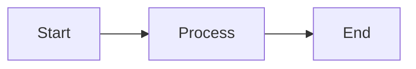

# Funcționalitate Fullscreen pentru Diagrame Mermaid

**Data implementare:** 7 februarie 2026  
**Status:** ✅ Implementat și funcțional

---

## 🎯 Descriere

Toate diagramele Mermaid din documentația Docusaurus au acum un **buton de fullscreen** în colțul dreapta sus care permite vizualizarea diagramei pe tot ecranul.

## ✨ Features Implementate

- ✅ **Buton "Fullscreen"** în colțul dreapta sus al fiecărei diagrame
- ✅ **Click pe buton** → diagramă se deschide fullscreen
- ✅ **Fundal semi-transparent** negru (95% opacitate)
- ✅ **Buton X roșu** pentru închidere (colț dreapta sus)
- ✅ **ESC key** pentru închidere rapidă
- ✅ **Click pe fundal** pentru închidere
- ✅ **Hint text** la baza ecranului: "Apasă ESC sau click pe fundal pentru a închide"
- ✅ **Suport dark mode** - fundal și stiluri adaptate automat
- ✅ **Animații smooth** - fade in pentru overlay
- ✅ **Responsive design** - funcționează pe mobile și desktop
- ✅ **Auto-detect** - funcționează automat pentru toate diagramele noi

## 📋 Cum Funcționează

### Pentru Utilizatori

1. **Găsește o diagramă Mermaid** în documentație
2. **Observă butonul verde "Fullscreen"** în colțul dreapta sus
3. **Click pe buton** - diagrama se deschide fullscreen
4. **Navighează** - scroll pentru diagrame mari
5. **Închide**:
   - Click pe butonul X roșu
   - Apasă tasta ESC
   - Click pe fundalul negru

### Pentru Dezvoltatori

Funcționalitatea este **complet automată** - nu necesită modificări în markdown-ul existent.

**Exemplu diagramă Mermaid:**

````markdown

````

Butonul de fullscreen va fi adăugat **automat** când pagina se încarcă.

---

## 🔧 Implementare Tehnică

### Fișiere Implicate

| Fișier | Rol | Status |
|--------|-----|--------|
| `static/js/mermaidFullscreen.js` | Script JavaScript principal | ✅ Creat |
| `src/css/custom.css` | Stiluri CSS | ✅ Actualizat |
| `docusaurus.config.js` | Configurare Docusaurus | ✅ Actualizat |

### Cum Funcționează Tehnic

1. **Script Loading**: `mermaidFullscreen.js` se încarcă async la fiecare pagină
2. **Auto-Detection**: MutationObserver detectează când Mermaid randează diagrame
3. **Button Injection**: Script-ul adaugă butonul de fullscreen în fiecare `.docusaurus-mermaid-container`
4. **Event Handling**: Click pe buton → overlay fullscreen cu clonă a diagramei
5. **Cleanup**: ESC/Click fundal/X button → remove overlay și restore scroll

### Selectori CSS Folosiți

```css
.docusaurus-mermaid-container  /* Container principal Mermaid */
.mermaid-fullscreen-btn        /* Buton fullscreen */
.mermaid-fullscreen-overlay    /* Fundal fullscreen */
.mermaid-fullscreen-content    /* Container diagramă în fullscreen */
.mermaid-fullscreen-close      /* Buton închidere */
.mermaid-fullscreen-hint       /* Text helper */
```

---

## 🎨 Personalizare

### Modificare Culoare Buton

**Fișier:** `src/css/custom.css`

```css
.mermaid-fullscreen-btn {
  background: var(--ifm-color-primary);  /* Schimbă culoarea aici */
}
```

### Modificare Poziție Buton

```css
.mermaid-fullscreen-btn {
  top: 10px;    /* Distanță de sus */
  right: 10px;  /* Distanță de dreapta */
}
```

### Modificare Opacitate Fundal

```css
.mermaid-fullscreen-overlay {
  background: rgba(0, 0, 0, 0.95);  /* 0.95 = 95% opacitate */
}
```

---

## 📱 Suport Responsive

### Desktop
- Buton complet cu text "Fullscreen"
- Padding generos în fullscreen
- Hint text la mărime normală

### Mobile (< 768px)
- Doar iconița (textul "Fullscreen" ascuns)
- Padding redus în fullscreen
- Hint text mai mic

---

## 🐛 Debugging

### Butonul Nu Apare

**Cauză comună:** Container-ul Mermaid are clase adiționale (ex: `docusaurus-mermaid-container container_lyt7`)

**Verificări:**

1. **Script loaded?**
   ```javascript
   // În browser console (F12)
   document.querySelector('script[src="/js/mermaidFullscreen.js"]')
   // Ar trebui să returneze elementul <script>
   ```

2. **Diagrama detectată?**
   ```javascript
   // Verifică dacă containerele sunt găsite
   document.querySelectorAll('[class*="docusaurus-mermaid-container"]')
   // Ar trebui să returneze NodeList cu diagrame
   ```

3. **Verifică console logs:**
   ```
   F12 → Console
   Caută: "[Mermaid Fullscreen] Found diagrams: X"
   Caută: "[Mermaid Fullscreen] Adding button to container: ..."
   ```

4. **CSS loaded?**
   ```javascript
   // Verifică stilurile butonului
   const btn = document.querySelector('.mermaid-fullscreen-btn');
   if (btn) {
     console.log(getComputedStyle(btn).position); // Ar trebui "absolute"
   }
   ```

### Butonul Apare dar Nu Funcționează

**Verifică:**
1. Click events: Deschide console și click pe buton - ar trebui să vezi overlay-ul
2. Verifică erori JavaScript în console
3. Verifică dacă `openFullscreen` function este definită:
   ```javascript
   typeof openFullscreen // ar trebui "function"
   ```

### Diagrama Nu Se Deschide Fullscreen

**Verifică console pentru erori:**
```
F12 → Console → Caută erori JavaScript
```

**Erori comune:**
- `Cannot read property 'cloneNode'` → Container invalid
- `overlay is not defined` → Problemă în funcția openFullscreen

### Stilurile Nu Se Aplică

**Cauză:** Cache browser sau CSS nu s-a încărcat

**Soluție:**
```bash
cd wh-svc-docs

# Opțiunea 1: Clear cache Docusaurus
npm run clear
npm run build
npm run serve

# Opțiunea 2: Hard refresh în browser
Ctrl + Shift + R (Windows/Linux)
Cmd + Shift + R (Mac)
```

### Container-ul Mermaid Nu Are Border

**Verifică:** Clasa containerului în HTML

```javascript
// În console
document.querySelectorAll('[class*="docusaurus-mermaid-container"]').forEach(el => {
  console.log(el.className);
  console.log(getComputedStyle(el).border);
});
```

**Fix temporar (test în console):**
```javascript
document.querySelectorAll('[class*="docusaurus-mermaid-container"]').forEach(el => {
  el.style.border = '1px solid #ddd';
  el.style.borderRadius = '8px';
  el.style.padding = '1rem';
});
```

---

## 🔄 Actualizări Viitoare (Opțional)

### Ideas pentru Îmbunătățiri

1. **Zoom In/Out** - butoane +/- în fullscreen
2. **Pan & Drag** - mutare diagramă cu mouse-ul
3. **Export PNG** - download diagramă ca imagine
4. **Share Link** - link direct către diagramă
5. **Print View** - versiune optimizată pentru print

---

## ✅ Testing Checklist

- [ ] Butonul apare pe toate diagramele Mermaid
- [ ] Click pe buton deschide fullscreen
- [ ] ESC închide fullscreen
- [ ] Click pe fundal închide fullscreen
- [ ] Buton X închide fullscreen
- [ ] Dark mode funcționează corect
- [ ] Responsive pe mobile
- [ ] Diagrame mari sunt scrollable în fullscreen
- [ ] Nu există erori în console
- [ ] Funcționează după navigare (SPA routing)

---

## 📚 Resurse

**Browser Support:**
- Chrome/Edge: ✅ Full support
- Firefox: ✅ Full support
- Safari: ✅ Full support
- Mobile browsers: ✅ Full support

**Dependencies:**
- Vanilla JavaScript (no external libs)
- CSS3 (animations, flexbox, grid)
- Docusaurus 3.9.2+
- @docusaurus/theme-mermaid 3.9.2+

---

**Autor:** GitHub Copilot  
**Data:** 7 februarie 2026  
**Versiune:** 1.0.0
