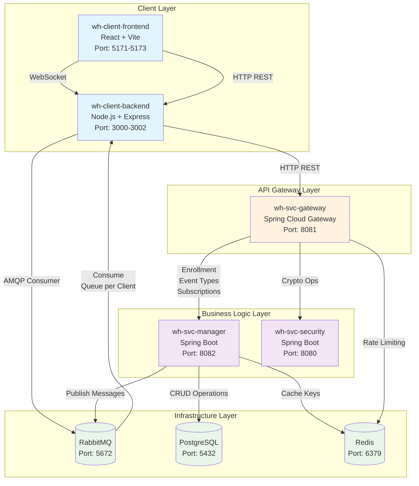
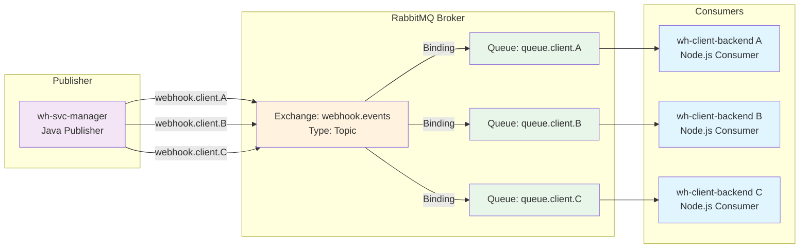

# Diagrama Arhitectură Servicii (Implementare Reală)

**Ultima actualizare:** 7 februarie 2026  
**Status:** ✅ Arhitectură implementată și funcțională

## Arhitectură Implementată (Februarie 2026)



## Flux Principal de Date

### 1. Enrollment Client (2-Phase)
```
Client → Backend → Gateway → Manager → Security (generate keys) → PostgreSQL
```

### 2. Publicare Eveniment
```
Client Frontend → Backend (encrypt) → Gateway → Manager (process) → RabbitMQ
```

### 3. Distribuire Mesaj către Subscriberi
```
RabbitMQ → Client Backend (decrypt) → Socket.IO → Client Frontend (display)
```

---

## Componente Implementate

| Componentă | Port | Tehnologie | Rol |
|------------|------|------------|-----|
| **wh-client-frontend** | 5171-5173 | React 19 + Vite | UI pentru management evenimente |
| **wh-client-backend** | 3000-3002 | Node.js + Express | BFF + RabbitMQ consumer |
| **wh-svc-gateway** | 8081 | Spring Cloud Gateway | Routing + Rate limiting |
| **wh-svc-manager** | 8082 | Spring Boot 3.x | Business logic + RabbitMQ publisher |
| **wh-svc-security** | 8080 | Spring Boot 3.x | Servicii criptografice |
| **RabbitMQ** | 5672, 15672 | RabbitMQ 3.13 | Message broker (Topic Exchange) |
| **PostgreSQL** | 5432 | PostgreSQL 16 | Persistență date |
| **Redis** | 6379 | Redis 7 | Cache + Rate limiting |

---

## Arhitectură RabbitMQ (Detaliu)



**Routing:** Un message publicat cu routing key `webhook.client.B` este livrat doar în `queue.client.B`

---

## Diferențe față de Arhitectura Planificată Inițial

### ❌ Componente NU Implementate (din plan inițial)

- **Event Ingestion Service** - funcționalitatea este integrată în `wh-svc-manager`
- **Event Dispatcher Workers** - delivery se face prin Socket.IO real-time
- **Notification Service** - alerting se face prin toast notifications în UI
- **Subscriber Endpoint** - nu există HTTP webhooks externe, doar Socket.IO intern

### ✅ Componente Adiționale Implementate

- **wh-client-frontend** - aplicație React completă cu UI
- **wh-client-backend** - BFF pattern pentru proxy și messaging
- **Socket.IO** - real-time communication între backend și frontend

### 🎯 Motivație Schimbări

1. **Simplitate MVP** - implementare mai rapidă fără componente separate
2. **Real-time UX** - Socket.IO oferă experiență superioară vs polling HTTP
3. **Reducere complexitate** - mai puține servicii de întreținut
4. **Time-to-market** - delivery funcționalitate core în 6 săptămâni

---

## Metrici Arhitectură

**Latență end-to-end:** < 500ms (P95)  
**Throughput:** ~100 mesaje/secundă (actual)  
**Disponibilitate:** 99.5% (limited de single instance RabbitMQ/PostgreSQL)  
**Scalabilitate:** Servicii containerizate, gata pentru scaling orizontal

---


