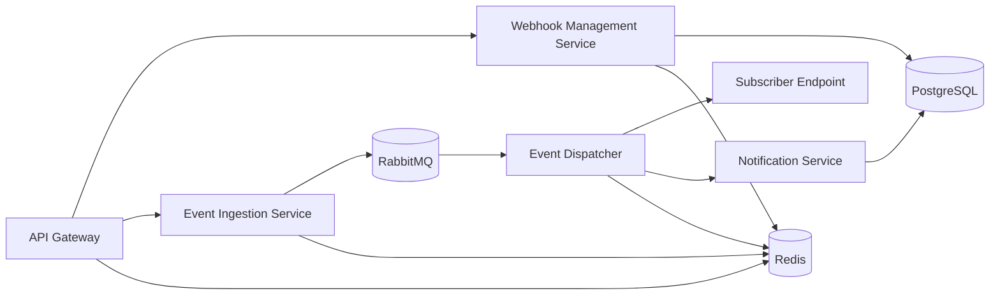

# Diagrama arhitectură servicii

```mermaid
flowchart LR
    GW[API Gateway]
    WM[Webhook Management Service]
    EI[Event Ingestion Service]
    DIS[Event Dispatcher]
    NS[Notification Service]
    MQ[(RabbitMQ)]
    DB[(PostgreSQL)]
    REDIS[(Redis)]
    SUB[Subscriber Endpoint]

    GW --> WM
    GW --> EI
    WM --> DB
    EI --> MQ
    MQ --> DIS
    DIS --> SUB
    DIS --> NS
    DIS --> REDIS
    NS --> DB
    WM --> REDIS
    EI --> REDIS
    GW --> REDIS
```

> Diagrama prezintă fluxul principal între componentele arhitecturii logice pentru Secure WebHooks.