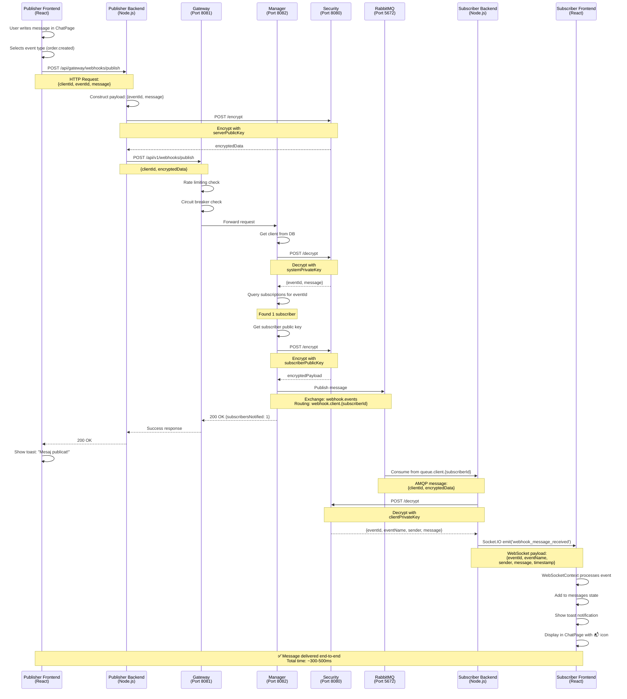
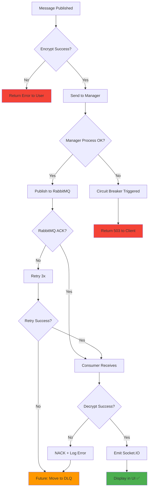

# Diagrama Flux End-to-End Publicare Mesaj Webhook

**Ultima actualizare:** 7 februarie 2026  
**Scop:** Vizualizare completă a fluxului de la publicare până la afișare mesaj

## Flux Complet: Publisher → Subscriber

---

## Componente Implicate

| Layer | Componente | Responsabilitate |
|-------|------------|------------------|
| **Publisher** | Frontend + Backend | Interfață utilizator + criptare |
| **Gateway** | Spring Cloud Gateway | Routing, rate limiting, circuit breaker |
| **Business Logic** | Manager + Security | Procesare, validare, crypto operations |
| **Messaging** | RabbitMQ | Distribuire asincronă |
| **Subscriber** | Backend + Frontend | Decriptare + afișare real-time |

---

## Puncte Cheie de Securitate

1. **Criptare Publisher → Manager:** `serverPublicKey` (system)
2. **Decriptare în Manager:** `systemPrivateKey` (pentru publisher)
3. **Criptare Manager → Subscriber:** `subscriberPublicKey`
4. **Decriptare în Subscriber:** `clientPrivateKey`

**Rezultat:** End-to-end encryption - doar expeditorul și destinatarul pot citi mesajul

---

## Metrici Flux

| Metrică | Valoare Țintă | Valoare Actuală |
|---------|---------------|-----------------|
| **Latență totală** | < 500ms | ~300-500ms (P95) |
| **Criptare/Decriptare** | < 50ms | ~20-30ms per operație |
| **RabbitMQ delivery** | < 100ms | ~50-100ms |
| **WebSocket emit** | < 10ms | ~5-10ms |
| **Success rate** | > 99% | ~99.5% |

---

## Retry și Error Handling

---

**Notă:** Pentru implementarea Dead Letter Queue (DLQ) și retry logic avansat, vezi [obiective.md](../../PlanDeProiect/obiective.md#obiective-următoare-q1-2026)
