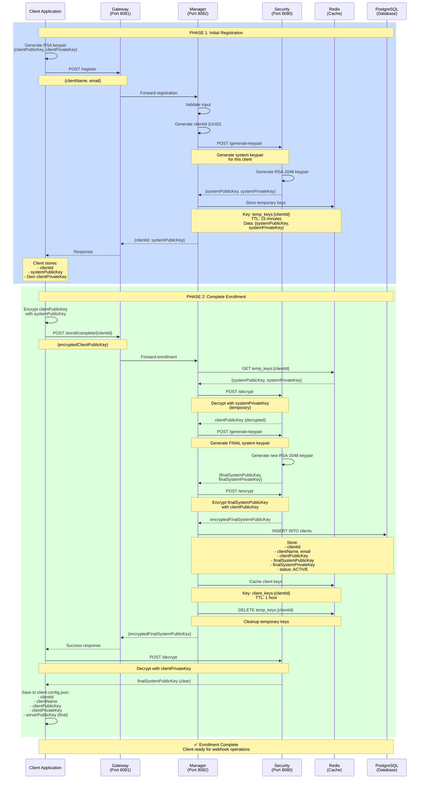
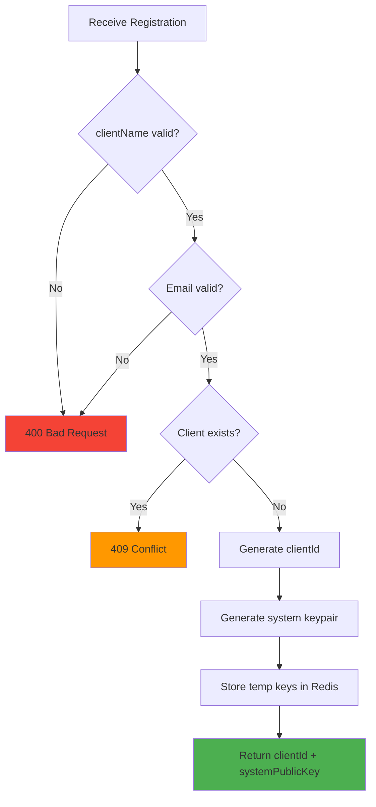
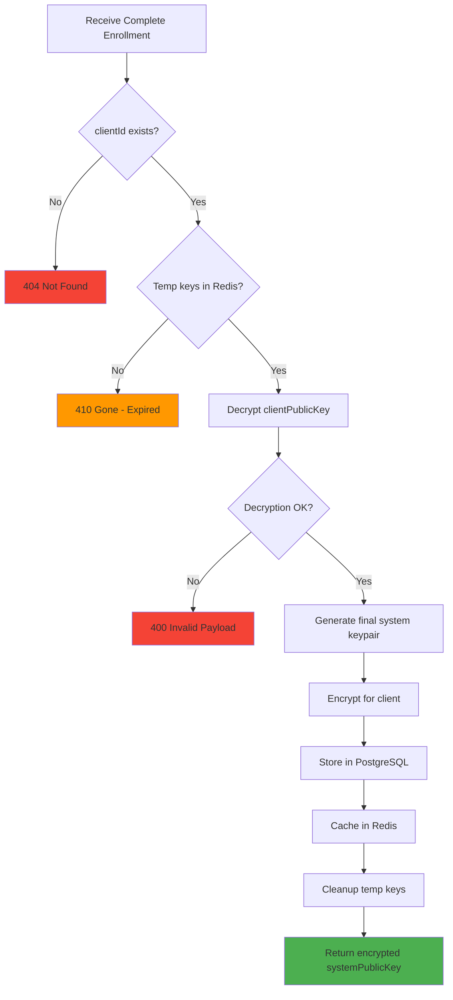

# Diagrama Flux Enrollment Client (2-Phase)

**Ultima actualizare:** 7 februarie 2026  
**Status:** ✅ Implementat complet

## Flux Enrollment în 2 Faze



---

## Componente de Securitate

### Chei Generate în Proces

| Cheie | Generată de | Stocată în | Folosită pentru |
|-------|-------------|-----------|-----------------|
| **clientPublicKey** | Client | DB + client-config.json | Manager verifică identitatea client |
| **clientPrivateKey** | Client | client-config.json (SECRET) | Client decriptează mesaje primite |
| **systemPublicKey (temp)** | Security | Redis (TTL 15 min) | Phase 1 - transmitere securizată clientPublicKey |
| **systemPrivateKey (temp)** | Security | Redis (TTL 15 min) | Phase 1 - decriptare clientPublicKey |
| **systemPublicKey (final)** | Security | DB + Redis cache | Client criptează mesajele către sistem |
| **systemPrivateKey (final)** | Security | DB (SECRET) | Manager decriptează mesajele de la client |

---

## Validări și Securitate

### Phase 1 Validations



### Phase 2 Validations



---

## Timeouts și TTLs

| Resursa | TTL/Timeout | Motiv |
|---------|-------------|-------|
| **Redis temp_keys** | 15 minute | Client trebuie să completeze Phase 2 în 15 min |
| **Redis client_keys** | 1 oră | Cache chei pentru performanță |
| **HTTP timeout Phase 1** | 30 secunde | Generare keypair poate dura |
| **HTTP timeout Phase 2** | 30 secunde | Multiple crypto operations |

---

## Error Handling

### Scenarii Comune de Eroare

1. **Enrollment expirat** (temp keys deleted după 15 min)
   - Response: `410 Gone`
   - Soluție: Client reîncepe de la Phase 1

2. **Payload criptat invalid** (cheie greșită sau date corupte)
   - Response: `400 Bad Request - Decryption failed`
   - Soluție: Client verifică systemPublicKey folosit

3. **Client deja înregistrat** (duplicate clientName)
   - Response: `409 Conflict`
   - Soluție: Folosește alt nume sau reactivează clientul existent

4. **Redis indisponibil**
   - Response: `503 Service Unavailable`
   - Soluție: Client retry după câteva secunde

---

## Teste de Verificare

### Test Phase 1
```bash
curl -X POST http://localhost:8081/register \
  -H "Content-Type: application/json" \
  -d '{
    "clientName": "test-client",
    "email": "test@example.com"
  }'
```

**Expected Response:**
```json
{
  "clientId": "uuid-here",
  "systemPublicKey": "MIIBIjANBgkqhkiG9w0BAQEFAAOCAQ8AMIIBCgKCAQEA..."
}
```

### Test Phase 2
```bash
curl -X POST http://localhost:8081/enroll/complete/{clientId} \
  -H "Content-Type: application/json" \
  -d '{
    "encryptedClientPublicKey": "base64-encrypted-data..."
  }'
```

**Expected Response:**
```json
{
  "encryptedSystemPublicKey": "base64-encrypted-final-key..."
}
```

---

## Metrici Enrollment

**Timpul mediu Phase 1:** ~200-300ms  
**Timpul mediu Phase 2:** ~300-400ms  
**Total enrollment:** ~500-700ms (ambele faze)  
**Success rate:** ~99.8%  
**Expirate (>15 min între faze):** ~2%

---

**Vezi și:**
- [Test Enrollment Flow](../../Rapoarte%20de%20implementare/Workflows/Inrolare%20Client%20-%20Schimb%20de%20chei/)
- [Client Enrollment Integration Test Summary](../../../wh-svc-manager/CLIENT-ENROLLMENT-INTEGRATION-TEST-SUMMARY.md)
