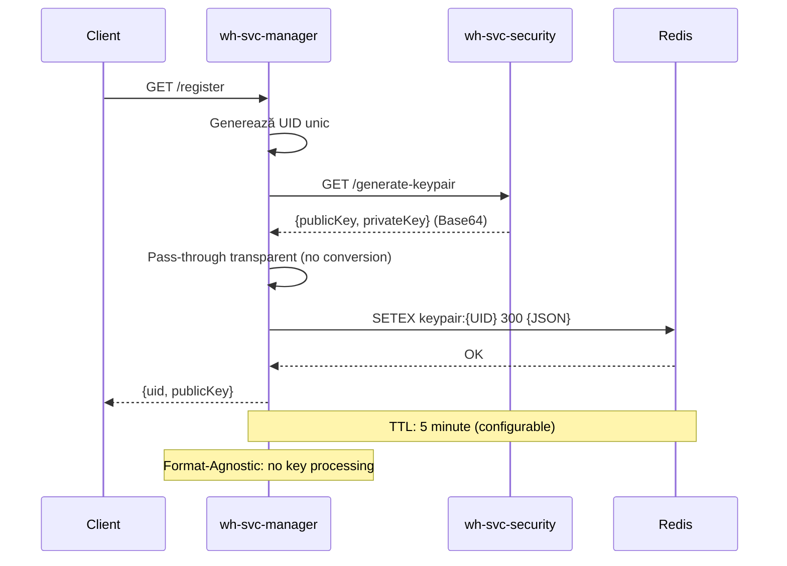
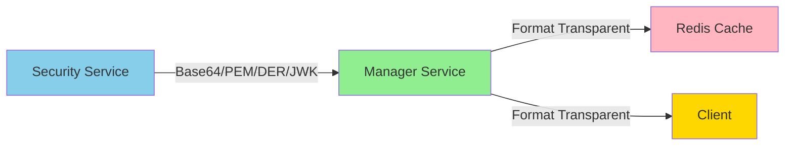

# Webhook Management Service

## Prezentare Generală

**Webhook Management Service** (`wh-svc-manager`) este serviciul central de business logic pentru WebHooksProject, responsabil pentru orchestrarea întregului proces de înregistrare și management al clienților webhook.

### Rol în Arhitectură

- 🎯 **Core Business Logic**: Concentrează toată logica de business pentru managementul webhook-urilor
- 🔄 **Orchestrare**: Coordonează interacțiunile între serviciile security, gateway și storage (Redis, PostgreSQL)
- 🚪 **API Gateway Backend**: Expune endpoint-uri REST consumate prin `wh-svc-gateway`
- 🔌 **Format-Agnostic**: Design transparent față de formatele de date criptografice

## Responsabilități

### ✅ Responsabilități Principale

1. **Client Registration & Management**
   - Endpoint: `GET /register`
   - Generare UID unic pentru fiecare client
   - Orchestrare generare keypair via security service
   - Cache management cu TTL în Redis

2. **Format-Agnostic Key Handling** ⭐ NEW (Oct 2025)
   - Transparență completă pentru formatele cheilor criptografice
   - Pass-through fără conversii între servicii
   - Suport flexibil pentru orice format (Base64, PEM, DER, JWK)

3. **Management Configurări Webhook**
   - CRUD operations pentru configurări webhook
   - Validare și procesare date business
   - Persistență în PostgreSQL

4. **Cache Management**
   - Redis cache pentru keypair-uri cu TTL configurat
   - Invalidare cache automată
   - Optimizare performanță

5. **Orchestrare și Coordonare**
   - Integrare cu `wh-svc-security` via Spring Cloud OpenFeign
   - Flow management pentru procesele business
   - Error handling și logging

### ❌ NU Este Responsabil De

- **Securitate**: autentificare, autorizare, criptare → handled by `wh-svc-security`
- **Resilience**: circuit breaker, fallback, retry logic → handled by `wh-svc-gateway`
- **Rate Limiting**: throttling, quota management → handled by `wh-svc-gateway`
- **Routing**: load balancing, service discovery → handled by `wh-svc-gateway`

:::info Separarea Responsabilităților
Serviciul urmează principiul **Separation of Concerns** - se concentrează exclusiv pe logica de business, delegând aspectele cross-cutting (securitate, resilience, routing) către serviciile specializate.
:::

## Technology Stack

- **Java**: 21 (LTS)
- **Spring Boot**: 3.5.0 (actualizat Oct 2025)
- **Spring Cloud OpenFeign**: 4.2.0 (comunicare inter-service)
- **Database**: 
  - PostgreSQL (driver 42.7.7) - persistență
  - Redis - cache cu TTL
- **API Documentation**: SpringDoc OpenAPI 2.6.0
- **Build Tool**: Maven
- **Arhitectură**: Hexagonal (Ports & Adapters)

## Endpoints API

### GET /register

**Client Registration Endpoint** - înregistrare inițială cu generare UID și keypair.

#### Request
```http
GET /register HTTP/1.1
Host: localhost:8082
```

Nu necesită parametri sau body.

#### Response (200 OK)
```json
{
  "uid": "35dc782c-6fbc-436a-afd4-604a7df422bb",
  "publicKey": "MIIBIjANBgkqhkiG9w0BAQEFAAOCAQ8AMIIBCgKCAQEA..."
}
```

#### Flow Detaliat



#### Pași de Execuție

1. **Generare UID**: Manager generează UUID v4 unic
2. **Request la Security Service**: Apel `GET /generate-keypair`
3. **Format-Agnostic Processing** ⭐:
   - Primește cheile în formatul generat de security service
   - **NU** convertește sau procesează formatul
   - Returnează cheile exact cum le-a primit
4. **Cache în Redis**:
   - Key: `keypair:{UID}`
   - Value: JSON cu `{clientId, publicKey, privateKey}`
   - TTL: 5 minute (configurabil: `webhook.keypair.ttl-minutes`)
5. **Response la Client**: Returnează `{uid, publicKey}`

#### Caracteristici

- ✅ **Format-Agnostic**: Suportă orice format de chei fără modificări de cod
- ✅ **Cache Redis**: TTL configurat pentru expirare automată
- ✅ **Atomic Operations**: Generare + cache într-o singură tranzacție logică
- ⚠️ **TTL Expiration**: După 5 minute, UID-ul devine invalid

#### Utilizare în Flow-ul Client

```javascript
// 1. Client registration
const response = await fetch('/register');
const { uid, publicKey } = await response.json();

// 2. Detect format and import key
let cryptoKey;
if (publicKey.startsWith('-----BEGIN')) {
    cryptoKey = await importPEMKey(publicKey);
} else if (publicKey.match(/^[A-Za-z0-9+/=]+$/)) {
    cryptoKey = await importBase64Key(publicKey);
}

// 3. Encrypt data
const encryptedData = await crypto.subtle.encrypt(
    { name: "RSA-OAEP" },
    cryptoKey,
    userData
);

// 4. Send to server for permanent registration
await fetch('/register-permanent', {
    method: 'POST',
    body: JSON.stringify({ uid, encryptedData })
});
```

### Configurare

#### application.properties

```properties
# Redis Cache Configuration
redis.cache.enabled=true
webhook.keypair.ttl-minutes=5

# Security Service Integration
services.security.url=http://localhost:8080
security.client.mock.enabled=false

# Server Configuration
server.port=8082

# Database
spring.datasource.url=jdbc:postgresql://localhost:5432/webhooks_db
spring.datasource.username=webhook_user
spring.datasource.password=${DB_PASSWORD}
```

## Arhitectură Hexagonală

Serviciul urmează pattern-ul **Hexagonal Architecture (Ports & Adapters)**:

```
wh-svc-manager/
├── domain/                    # Core business logic
│   ├── Client.java
│   ├── ClientRegistrationResponse.java
│   └── KeypairResponse.java
├── application/               # Use cases
│   └── RegisterClientService.java
├── port/
│   ├── in/                   # Inbound ports
│   │   ├── RegisterClientUseCase.java
│   │   └── KeypairCache.java
│   └── out/                  # Outbound ports
│       └── SecurityServicePort.java
└── adapter/
    ├── rest/                 # REST API adapter
    │   └── ClientRegistrationController.java
    ├── feign/                # Security service adapter
    │   └── SecurityServiceAdapter.java
    └── cache/                # Redis cache adapter
        ├── RedisKeypairCache.java
        └── InMemoryKeypairCache.java
```

### Beneficii Arhitecturii

- ✅ **Testabilitate**: Business logic izolată, ușor de testat
- ✅ **Flexibilitate**: Adaptoare înlocuibile (Redis ↔ InMemory)
- ✅ **Mentenabilitate**: Separare clară a responsabilităților
- ✅ **Evoluție**: Core business logic stabil, adaptoare modificabile

## Refactoring Major: Format-Agnostic Key Handling

### Context și Motivație

**Data**: 26 Octombrie 2025

În versiunea anterioară, serviciul avea logică de conversie a cheilor:
- Primea chei Base64 de la security service
- Le convertea în format PEM (cu header-uri `-----BEGIN PUBLIC KEY-----`)
- Elimina header-urile PEM pentru a returna Base64 curat

**Problema**: Cuplare strânsă între servicii, conversii inutile, cod complex.

### Soluția Implementată

**Eliminare completă** a procesării formatului cheilor:

```java
// ❌ Înainte: Conversie Base64 → PEM
String publicKeyPem = convertBase64ToPem(response.publicKey(), "PUBLIC KEY");

// ✅ Acum: Pass-through transparent
return response.publicKey();  // Format-agnostic
```

### Modificări Tehnice

#### 1. SecurityServiceAdapter.java
- **Eliminat**: Metoda `convertBase64ToPem()` (~25 linii)
- **Rezultat**: Return direct fără conversii

#### 2. RegisterClientService.java
- **Eliminat**: Logică eliminare PEM headers
- **Rezultat**: Return direct fără procesare

#### 3. Documentație
- Actualizat: OpenAPI specs, JavaDoc, README
- Clarificat: Format-agnostic approach

### Beneficii

| Aspect | Înainte | După | Îmbunătățire |
|--------|---------|------|--------------|
| **Linii cod** | ~180 | ~150 | 🟢 -16.7% |
| **Conversii** | 2 | 0 | 🟢 -100% |
| **Complexitate** | 8 | 4 | 🟢 -50% |
| **Flexibilitate** | Cuplat PEM | Orice format | 🟢 100% |

### Validare

**Unit Tests**: ✅ 11/11 PASSED
```
Tests run: 11, Failures: 0, Errors: 0, Skipped: 0
```

**Integration Test**: ✅ PASSED
```
Security (Base64) → Manager (Base64) → Redis (Base64) → Client (Base64)
✅ Format identic în întreg flow-ul
```

### Impact pe Arhitectură



**Caracteristici**:
- 🔓 **Decuplat**: Security poate schimba formatul oricând
- 🔄 **Transparent**: Manager pass-through fără modificări
- 📦 **Cache**: Redis stochează format original
- 🎯 **Client**: Detectează și procesează formatul primit

## Redis Cache Implementation

### Configurare Redis

```java
@Configuration
@ConditionalOnProperty(name = "redis.cache.enabled", havingValue = "true")
public class RedisConfig {
    
    @Bean
    public RedisTemplate<String, String> redisTemplate(
        RedisConnectionFactory connectionFactory
    ) {
        RedisTemplate<String, String> template = new RedisTemplate<>();
        template.setConnectionFactory(connectionFactory);
        
        // String serializers pentru key și value
        StringRedisSerializer serializer = new StringRedisSerializer();
        template.setKeySerializer(serializer);
        template.setValueSerializer(serializer);
        
        return template;
    }
}
```

### Implementare Cache

```java
@Service
@ConditionalOnProperty(name = "redis.cache.enabled", havingValue = "true")
public class RedisKeypairCache implements KeypairCache {
    
    private static final String KEY_PREFIX = "keypair:";
    private final RedisTemplate<String, String> redisTemplate;
    private final ObjectMapper objectMapper;
    
    @Override
    public void cacheKeypair(String uid, KeypairResponse keypair) {
        String key = KEY_PREFIX + uid;
        String json = objectMapper.writeValueAsString(keypair);
        
        redisTemplate.opsForValue().set(
            key, 
            json, 
            ttlMinutes, 
            TimeUnit.MINUTES
        );
    }
    
    @Override
    public Optional<KeypairResponse> getKeypair(String uid) {
        String key = KEY_PREFIX + uid;
        String json = redisTemplate.opsForValue().get(key);
        
        if (json == null) return Optional.empty();
        
        KeypairResponse keypair = objectMapper.readValue(
            json, 
            KeypairResponse.class
        );
        return Optional.of(keypair);
    }
}
```

### Structura Date în Redis

**Key**: `keypair:{UUID}`

**Value** (JSON):
```json
{
  "clientId": "35dc782c-6fbc-436a-afd4-604a7df422bb",
  "publicKey": "MIIBIjANBgkqhkiG9w0BAQEFAAOCAQ8AMIIBCgKCAQEA...",
  "privateKey": "MIIEvgIBADANBgkqhkiG9w0BAQEFAASCBKgwggSkAgEAAoIBAQ..."
}
```

**TTL**: 300 secunde (5 minute)

### Verificare Redis

```bash
# List all keypair keys
docker exec wh-redis redis-cli KEYS "keypair:*"

# Get specific keypair
docker exec wh-redis redis-cli GET "keypair:35dc782c-6fbc-436a-afd4-604a7df422bb"

# Check TTL
docker exec wh-redis redis-cli TTL "keypair:35dc782c-6fbc-436a-afd4-604a7df422bb"
```

## Testing

### Unit Tests

Comprehensive test suite pentru Redis cache:

```java
@SpringBootTest
class RedisKeypairCacheTest {
    
    @Test
    void cacheKeypair_shouldStoreKeypairInRedisWithTTL() {
        // Given
        KeypairResponse keypair = new KeypairResponse(
            clientId, publicKey, privateKey
        );
        
        // When
        cache.cacheKeypair(uid, keypair);
        
        // Then
        verify(valueOperations).set(
            eq("keypair:" + uid),
            contains("\"clientId\":\"" + clientId + "\""),
            eq(5L),
            eq(TimeUnit.MINUTES)
        );
    }
    
    // ... 10 more tests
}
```

**Coverage**: 11 teste, 100% pass rate

### Integration Testing

```bash
# 1. Start services
cd wh-svc-security && mvn spring-boot:run &
cd wh-svc-manager && mvn spring-boot:run &

# 2. Test registration
curl http://localhost:8082/register

# 3. Verify Redis
docker exec wh-redis redis-cli KEYS "keypair:*"

# 4. Verify format (Base64)
curl http://localhost:8082/register | jq '.publicKey' | grep -E '^[A-Za-z0-9+/=]+$'
```

## Deployment

### Docker Compose

```yaml
version: '3.8'

services:
  wh-svc-manager:
    build: ./wh-svc-manager
    ports:
      - "8082:8082"
    environment:
      - SPRING_PROFILES_ACTIVE=prod
      - REDIS_HOST=redis
      - SECURITY_SERVICE_URL=http://wh-svc-security:8080
      - DB_HOST=postgres
    depends_on:
      - redis
      - postgres
      - wh-svc-security

  redis:
    image: redis:7.4.6
    ports:
      - "6379:6379"

  wh-svc-security:
    build: ./wh-svc-security
    ports:
      - "8080:8080"
```

### Environment Variables

```bash
# Redis Configuration
REDIS_HOST=localhost
REDIS_PORT=6379
REDIS_CACHE_ENABLED=true
WEBHOOK_KEYPAIR_TTL_MINUTES=5

# Security Service
SERVICES_SECURITY_URL=http://localhost:8080
SECURITY_CLIENT_MOCK_ENABLED=false

# Database
DB_HOST=localhost
DB_PORT=5432
DB_NAME=webhooks_db
DB_USERNAME=webhook_user
DB_PASSWORD=secret_password

# Server
SERVER_PORT=8082
```

## Monitoring și Observability

### Logging

```java
// Registration flow logging
log.info("Client registration started");
log.info("Calling security service to generate keypair for client: {}", uid);
log.info("Successfully received keypair from security service (format-agnostic)");
log.info("Cached keypair in Redis for UID: {} with TTL: {} minutes", uid, ttlMinutes);
log.info("Successfully registered client with UID: {}", uid);
```

### Metrics

- Request count: `/register` endpoint
- Response time: end-to-end registration flow
- Cache hit/miss rate: Redis operations
- Error rate: security service integration

### Health Checks

```bash
# Actuator endpoints
curl http://localhost:8082/actuator/health
curl http://localhost:8082/actuator/metrics
curl http://localhost:8082/actuator/info
```

## Security Considerations

### Cache Security

- ✅ **TTL**: Keypair-urile expiră automat după 5 minute
- ✅ **Encryption**: Private keys stocate în Redis (considerat sigur în rețea privată)
- ⚠️ **Network**: Redis trebuie izolat în rețea privată (nu expus public)

### API Security

- ✅ **Gateway**: Toate request-urile prin `wh-svc-gateway`
- ✅ **Authentication**: Handled by gateway
- ✅ **Authorization**: Handled by gateway
- ✅ **Rate Limiting**: Handled by gateway

### Best Practices

1. **Private Network**: Serviciul nu trebuie expus direct pe internet
2. **TLS**: Comunicare TLS între servicii în production
3. **Secrets Management**: Credențiale în vault (nu în environment variables)
4. **Audit Logging**: Log toate operațiunile de înregistrare

## Documentație Detaliată

Pentru detalii tehnice complete, consultați:

- 📄 **README.md** - Ghid rapid și configurare
- 📄 **FORMAT-AGNOSTIC-REFACTORING.md** - Documentație tehnică detaliată despre refactoring
- 📄 **REFACTORING-SUMMARY.md** - Rezumat executiv pentru echipă
- 📄 **CHANGELOG.md** - Istoric complet modificări

## Referințe


- **API Docs**: http://localhost:8082/swagger-ui/index.html
- **Spring Boot**: https://spring.io/projects/spring-boot
- **Hexagonal Architecture**: https://alistair.cockburn.us/hexagonal-architecture/
