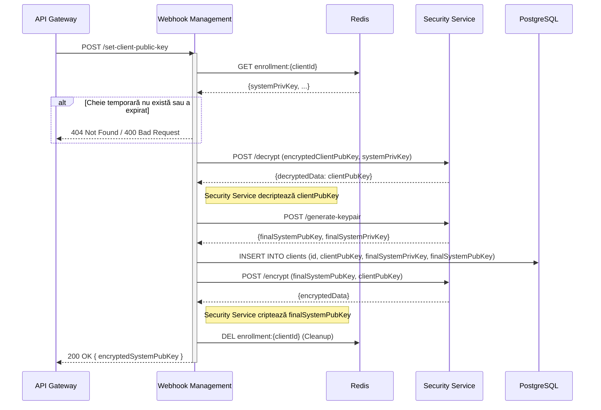

# Plan de Implementare: Înrolare Client - Faza 2 (Schimb Securizat de Chei)

Acest plan detaliază implementarea celei de-a doua faze a procesului de înrolare a clienților, concentrându-se pe schimbul securizat de chei publice și stabilirea canalului de încredere criptografic.

## 1. Descrierea funcționalității

Obiectivul este finalizarea procesului de înrolare prin schimbul cheilor publice între client și sistem într-un mod securizat. Clientul trimite cheia sa publică criptată cu cheia publică temporară a sistemului (primită în Faza 1). Sistemul decriptează cheia clientului, generează o pereche finală de chei dedicate acestui client, stochează cheile și returnează cheia publică finală a sistemului, criptată cu cheia publică a clientului.

## 2. Componente implicate

*   **API Gateway**: Expunere și rutare endpoint public.
*   **Webhook Management Service**: Componenta centrală care orchestrează fluxul, execută operațiuni criptografice și gestionează persistența.
*   **Security Service**: Generator de chei criptografice (RSA).
*   **Redis**: Sursă pentru cheia privată temporară generată în Faza 1.
*   **PostgreSQL**: Stocare persistentă a datelor clientului și a cheilor finale.

## 3. Arhitectură tehnică

### Webhook Management Service
Se va utiliza arhitectura hexagonală existentă:
*   **Inbound Adapter (REST)**: `ClientEnrollmentController` va expune endpoint-ul `/set-client-public-key`.
*   **Domain Service**: `ClientEnrollmentService` va implementa logica de business (orchestrare flux).
*   **Outbound Ports**:
    *   `TemporaryKeyRepository` (Redis) - pentru recuperarea datelor temporare de înregistrare.
    *   `ClientRepository` (PostgreSQL) - pentru salvarea clientului și a cheilor.
    *   `SecurityServicePort` (Security Service) - pentru operațiuni criptografice:
        *   Generare perechi de chei
        *   Decriptare date cu cheie privată
        *   Criptare date cu cheie publică

### Security Service
Va expune endpoint-uri dedicate pentru toate operațiunile criptografice (existente din Faza 1).:
*   **GET /generate-keypair** - Generare pereche de chei RSA 
*   **POST /decrypt** - Decriptare date cu cheie privată.
*   **POST /encrypt** - Criptare date cu cheie publică.

## 4. Modele de date

### PostgreSQL (Webhook Management Service)
Tabel nou: `clients` (sau actualizare dacă există un tabel parțial din Faza 1).

```sql
CREATE TABLE clients (
    client_id UUID PRIMARY KEY,
    client_public_key TEXT NOT NULL, -- Cheia publică a clientului (PEM format)
    system_private_key TEXT NOT NULL, -- Cheia privată a sistemului pentru acest client (PEM format, posibil criptată la rest)
    system_public_key TEXT NOT NULL, -- Cheia publică a sistemului pentru acest client (PEM format)
    status VARCHAR(50) NOT NULL, -- ex: 'ACTIVE', 'PENDING'
    created_at TIMESTAMP WITH TIME ZONE DEFAULT CURRENT_TIMESTAMP,
    updated_at TIMESTAMP WITH TIME ZONE DEFAULT CURRENT_TIMESTAMP
);
```

### Redis (Existent din Faza 1)
Cheie: `enrollment:{clientId}`
Valoare (JSON):
```json
{
  "systemPrivateKey": "...",
  "systemPublicKey": "...",
  "createdAt": "..."
}
```

## 5. API-uri

### API Gateway -> Webhook Management Service

**Endpoint**: `POST /set-client-public-key`

**Request Body**:
```json
{
  "clientId": "550e8400-e29b-41d4-a716-446655440000",
  "encryptedClientPublicKey": "Base64EncodedString..." 
}
```

**Response Body (Success 200)**:
```json
{
  "encryptedSystemPublicKey": "Base64EncodedString..."
}
```

**Response (Error 400/404/500)**:
```json
{
  "code": "ERROR_CODE",
  "message": "Description of error"
}
```

### Webhook Management Service -> Security Service

**Endpoint 1**: `POST /generate-keypair` (Existent din Faza 1)

**Response**:
```json
{
  "publicKey": "PEM...",
  "privateKey": "PEM..."
}
```

**Endpoint 2**: `POST /decrypt` (Nou)

**Request Body**:
```json
{
  "encryptedData": "Base64EncodedString...",
  "privateKey": "PEM format private key..."
}
```

**Response**:
```json
{
  "decryptedData": "Base64EncodedString..." 
}
```

**Endpoint 3**: `POST /encrypt` (Nou)

**Request Body**:
```json
{
  "data": "Base64EncodedString...",
  "publicKey": "PEM format public key..."
}
```

**Response**:
```json
{
  "encryptedData": "Base64EncodedString..."
}
```

## 6. Fluxuri de comunicare



## 7. Dependențe

### Webhook Management Service
*   **Spring Data JPA**: Pentru persistența în PostgreSQL.
*   **Spring Data Redis**: Pentru accesul la Redis.
*   **Spring Cloud OpenFeign**: Pentru comunicarea cu Security Service.

### Security Service
*   **Java Security / Bouncy Castle**: Pentru operațiunile de criptare/decriptare RSA.
*   **Spring Boot**: Framework de bază pentru expunere API-uri REST.

## 8. Secvență de implementare

1.  **Infrastructură - PostgreSQL Container**:
    *   Adăugare serviciu PostgreSQL în `wh-docker-system/docker-compose.yml`:
        ```yaml
        postgres:
          image: postgres:16-alpine
          container_name: wh-postgres
          ports:
            - "5432:5432"
          environment:
            - POSTGRES_DB=webhooks
            - POSTGRES_USER=webhooks_user
            - POSTGRES_PASSWORD=webhooks_pass
          volumes:
            - postgres-data:/var/lib/postgresql/data
          networks:
            - webhooks-network
          restart: unless-stopped
          healthcheck:
            test: ["CMD-SHELL", "pg_isready -U webhooks_user -d webhooks"]
            interval: 30s
            timeout: 10s
            retries: 3
            start_period: 40s
        ```
    *   Adăugare volum persistent pentru date:
        ```yaml
        volumes:
          postgres-data:
        ```
2.  **Baza de date - Schema**:
    *   Creare script migrare (Liquibase/Flyway) pentru tabelul `clients`.
3.  **Security Service - endpoint-uri criptografice**:
    *   Validare endpoint `POST /decrypt`:
        *   Request: `{encryptedData, privateKey}`
        *   Response: `{decryptedData}`
        *   Utilizare Bouncy Castle pentru decriptare RSA.
    *   Validare endpoint `POST /encrypt`:
        *   Request: `{data, publicKey}`
        *   Response: `{encryptedData}`
        *   Utilizare Bouncy Castle pentru criptare RSA.
    *   Adăugare validări pentru format chei și date.
    *   Tratare erori criptografice (InvalidKeyException, BadPaddingException).
4.  **Webhook Management Service - Configurare conexiune DB**:
    *   Adăugare dependențe în `pom.xml`: PostgreSQL driver, Spring Data JPA.
    *   Configurare `application.yml` pentru conexiunea la PostgreSQL:
        ```yaml
        spring:
          datasource:
            url: jdbc:postgresql://wh-postgres:5432/webhooks
            username: webhooks_user
            password: webhooks_pass
          jpa:
            hibernate:
              ddl-auto: validate
            properties:
              hibernate:
                dialect: org.hibernate.dialect.PostgreSQLDialect
        ```
5.  **Webhook Management Service - Domain**:
    *   Definire entitate `Client` (JPA entity).
6.  **Webhook Management Service - Adapters**:
    *   Implementare `ClientRepository` (JPA).
    *   Implementare `TemporaryKeyRepository` (Redis) - metoda `findById`.
    *   Implementare `SecurityServiceClient` (Feign) - metode:
        *   `generateKeyPair()`
        *   `decrypt(encryptedData, privateKey)`
        *   `encrypt(data, publicKey)`
7.  **Webhook Management Service - Application**:
    *   Implementare `ClientEnrollmentService`.
    *   Logica: 
        1. Retrieve Redis (sistemPrivKey)
        2. Call Security Service `/decrypt` (encryptedClientPubKey, systemPrivKey)
        3. Call Security Service `/generate-keypair` (finalKeys)
        4. Save DB (Client entity)
        5. Call Security Service `/encrypt` (finalSystemPubKey, clientPubKey)
        6. Delete Redis entry (cleanup)
        7. Return encrypted response
    *   Tratare erori (chei invalide, erori decriptare, Redis miss, Security Service failures).
8.  **Webhook Management Service - API**:
    *   Creare DTO-uri (`SetPublicKeyRequest`, `SetPublicKeyResponse`).
    *   Implementare Controller endpoint.
9.  **API Gateway**:
    *   Configurare rută în `application.yml` pentru `/set-client-public-key`.

## 9. Teste

*   **Unit Tests (Service Layer)**:
    *   Mock `RedisRepository` pentru a returna o cheie privată de test.
    *   Mock `SecurityService` pentru a returna o pereche de chei nouă.
    *   Mock `ClientRepository`.
    *   Testare flux succes: verificare decriptare corectă și apelare metode repository.
    *   Testare erori: cheie Redis lipsă, format cheie invalid (crypto exception).
*   **Integration Tests**:
    *   Test cu container Redis și PostgreSQL (Testcontainers).
    *   Verificare că datele sunt salvate corect în DB.
    *   Verificare că cheia din Redis este ștearsă după succes (opțional, dar recomandat).
*   **Security Tests**:
    *   Verificare că endpoint-ul acceptă doar payload valid.
    *   Verificare comportament la chei publice malformate.

