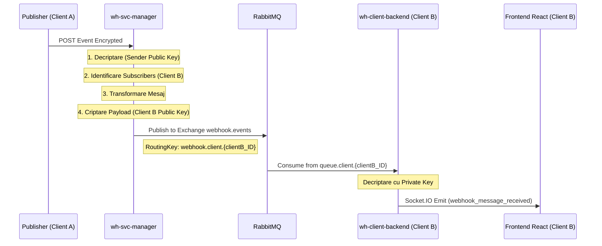

# Rapoarte Implementare: Message Distribution Workflow

Acest director conține documentația tehnică pentru implementarea sistemului de distribuire mesaje prin RabbitMQ între `wh-svc-manager` și `wh-client-backend`.

## Index Rapoarte

### ✅ [01 - RabbitMQ Consumer Setup](./01-rabbitmq-consumer-setup.md)
**Status:** Finalizat  
**Data:** 2026-02-06  
**Componenta:** `wh-client-backend` (Node.js)

Implementarea consumer-ului RabbitMQ în aplicația client:
- Instalare `amqplib`
- Creare `rabbitmqService.js`
- Integrare în `index.js`
- Configurare Docker Compose

---

### ✅ [02 - RabbitMQ Publisher Setup (wh-svc-manager)](./02-rabbitmq-publisher-setup.md)
**Status:** Finalizat  
**Data:** 2026-02-06  
**Componenta:** `wh-svc-manager` (Java/Spring)

Implementarea publisher-ului RabbitMQ în serviciul manager:
- Adăugare `spring-boot-starter-amqp`
- Configurare RabbitMQ în `application.properties`
- Creare `MessageDeliveryService`, Port și Adapter
- Creare REST endpoint `/api/v1/webhooks/publish`
- Adăugare rută în `wh-svc-gateway`

---

### ✅ [03 - Frontend Integration](./03-frontend-integration.md)
**Status:** Finalizat  
**Data:** 2026-02-06  
**Componenta:** `wh-client-frontend` (React)

Integrare ascultare și afișare mesaje RabbitMQ în interfața utilizator:
- Instalare `notistack`
- Actualizare `WebSocketContext` cu listener
- Modificare `ChatPage` pentru afișare mesaje RabbitMQ
- Sistem notificări toast
- UI distinct pentru mesaje externe (purple, 📬)

---

## Ghiduri Auxiliare

### 📘 [CONFIG-RABBITMQ-ENVIRONMENTS.md](./CONFIG-RABBITMQ-ENVIRONMENTS.md)
Ghid complet pentru configurarea RabbitMQ în diferite medii (local vs Docker).

---

## Arhitectură Implementată

---

## Status General Implementare

| Etapa | Componenta | Status | Data |
|-------|-----------|--------|------|
| 1 | Consumer (Node.js) | ✅ Finalizat | 2026-02-06 |
| 2 | Publisher (Java) | ✅ Finalizat | 2026-02-06 |
| 3 | Frontend Integration | ✅ Finalizat | 2026-02-06 |
| 4 | Gateway Route | ✅ Finalizat | 2026-02-06 |

**🎉 TOATE ETAPELE COMPLETE - SISTEM OPERATIONAL!**

---

**Plan complet:** [IMPLEMENTATION-PLAN-MESSAGING.md](../../Planuri de implementare/IMPLEMENTATION-PLAN-MESSAGING.md)

**Ultima actualizare:** 2026-02-06
