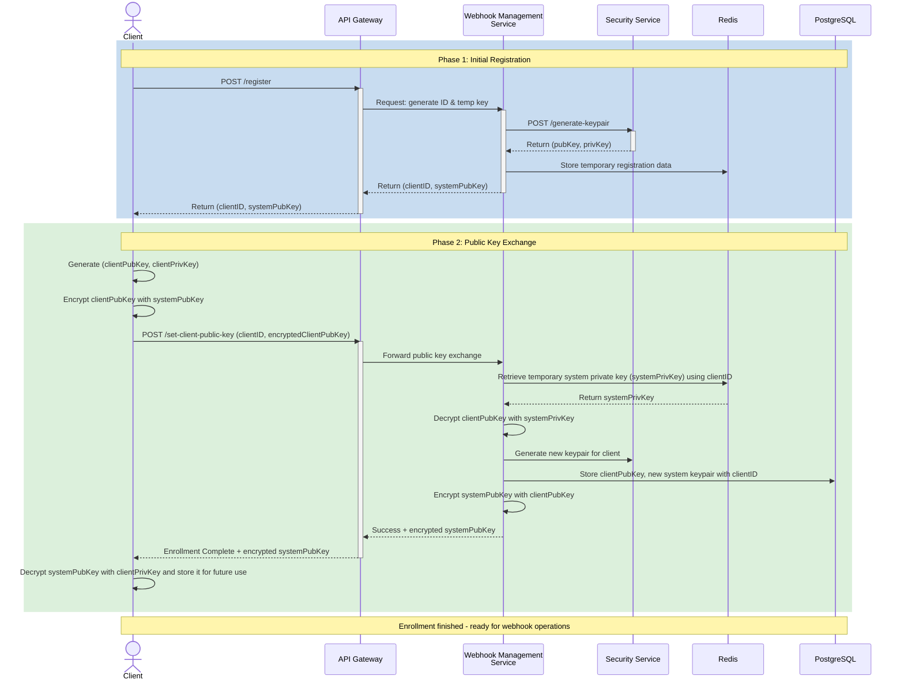

Arhitectură bazată pe microservicii pentru decuplare, scalabilitate și izolare a responsabilităților.

## Componente sistem:

1. API Gateway (Spring Cloud Gateway)
   - Autentificare & autorizare
   - Rate limiting & circuit breakers
   - Routing centralizat
2. Webhook Management Service
   - CRUD subscripții
   - Validare endpoint + stocare secret
   - Exporte configurări
3. Event Ingestion Service
   - Expune endpoint securizat de primire evenimente
   - Enrich + validare payload
   - Publicare în RabbitMQ (exchange topic)
4. Event Dispatcher (Workers)
   - Consumă mesaje (queues per event type)
   - Calculează semnătură HMAC
   - Trimite HTTP webhook (WebClient non-blocking)
   - Retries + backoff + DLQ
5. Notification Service (opțional)
   - Alerte eșec livrare persistentă (email / webhook intern)
6. Security Service
   - Management chei criptografice (asymetric)
   - Rotire chei periodică
   - API pentru semnare/validare HMAC
7. Observability Stack
   - Prometheus + Grafana (metrici)
   - ELK (loguri structurate + corelare)
   - Tracing (OpenTelemetry) – distribuție latențe
8. RabbitMQ Cluster
   - Exchange topic pentru evenimente
   - Cozi dedicate per tip eveniment
   - Politici de retry și DLQ
9. Baza de date (PostgreSQL)
   - Stocare subscripții, secrete, jurnale livrări
   - Indici pentru performanță
10. Redis Cache
   - Caching subscripții active
   - Rate limiting counters

## Flux de inrolare client in sistem:

### Faza 1: Înregistrare inițială

:::info
Această secțiune descrie prima fază a procesului de înrolare a unui client, evidențiind pașii necesari pentru inițierea și securizarea înregistrării prin API Gateway.
:::

1. **Client solicită înrolare:**
   - Client trimite cerere de înregistrare prin API Gateway `/register`

2. **API Gateway procesează cererea:**
   - Gateway solicită un ID client și o cheie publică temporară de la Webhook Management Service

3. **Webhook Management Service generează date temporare:**
   - Solicită o pereche de chei (publică și privată) de la Security Service `/generate-keypair`
   - Primește perechea de chei (systemPubKey, systemPrivKey) de la Security Service
   - Stochează date temporare de înregistrare în Redis (inclusiv systemPrivKey pentru Faza 2)
   - Returnează către Gateway: clientID și systemPubKey

4. **Client primește date inițiale:**
   - API Gateway returnează clientID și systemPubKey către client
   - Client stochează systemPubKey pentru utilizare în Faza 2

### Faza 2: Schimb securizat de chei publice

:::info
Această secțiune detaliază a doua fază a procesului de înrolare, concentrându-se pe schimbul securizat de chei publice între client și sistem, asigurând integritatea și confidențialitatea comunicațiilor viitoare.
:::

1. **Client pregătește propriile chei:**
   - Client generează propria pereche de chei (clientPubKey, clientPrivKey)
   - Client criptează clientPubKey folosind systemPubKey primită în Faza 1
   - Rezultat: encryptedClientPubKey

2. **Client trimite cheia publică criptată:**
   - Client trimite prin API Gateway `/set-client-public-key` cu payload: (clientID, encryptedClientPubKey)
   - Gateway transmite cererea către Webhook Management Service

3. **Webhook Management Service procesează cheia publică a clientului:**
   - Recuperează systemPrivKey temporară din Redis folosind clientID
   - Decriptează encryptedClientPubKey folosind systemPrivKey
   - Obține clientPubKey în clar

4. **Generare pereche finală de chei:**
   - Webhook Management Service solicită Security Service să genereze o nouă pereche de chei pentru client
   - Primește noua pereche (finalSystemPubKey, finalSystemPrivKey)

5. **Stocare în baza de date:**
   - Stochează în PostgreSQL:
     - clientID
     - clientPubKey (decriptată)
     - finalSystemPrivKey (cheia privată finală a sistemului pentru acest client)
     - finalSystemPubKey

6. **Răspuns securizat către client:**
   - Webhook Management Service criptează finalSystemPubKey folosind clientPubKey
   - Returnează către Gateway: Success status + encrypted finalSystemPubKey
   - Gateway transmite către client: Enrollment Complete + encrypted finalSystemPubKey

7. **Client finalizează înrolarea:**
   - Client decriptează encrypted finalSystemPubKey folosind clientPrivKey
   - Stochează finalSystemPubKey pentru utilizare viitoare în operațiuni webhook
   - Înrolarea este completă - ambele părți dețin cheile publice reciproce

## Diagrama de secvență pentru înrolare:

