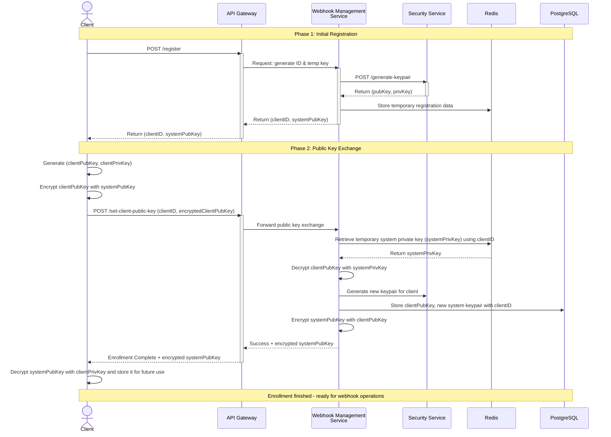
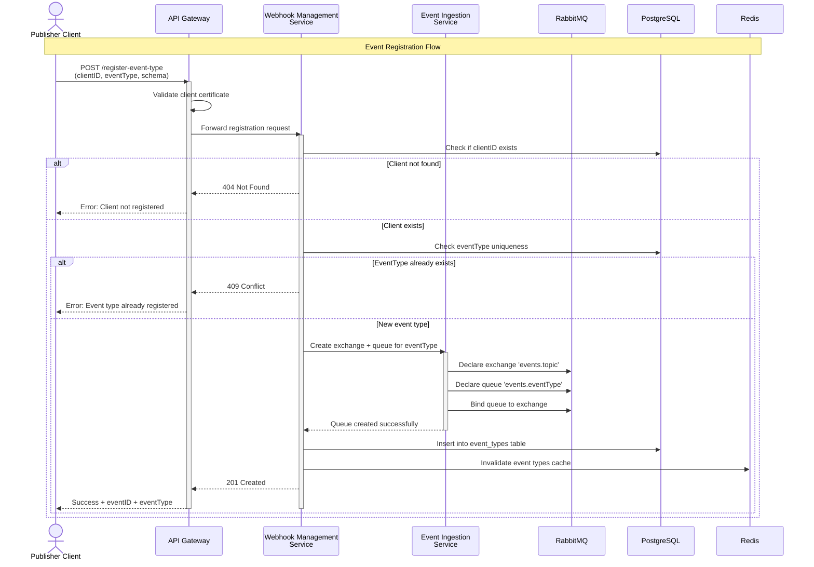
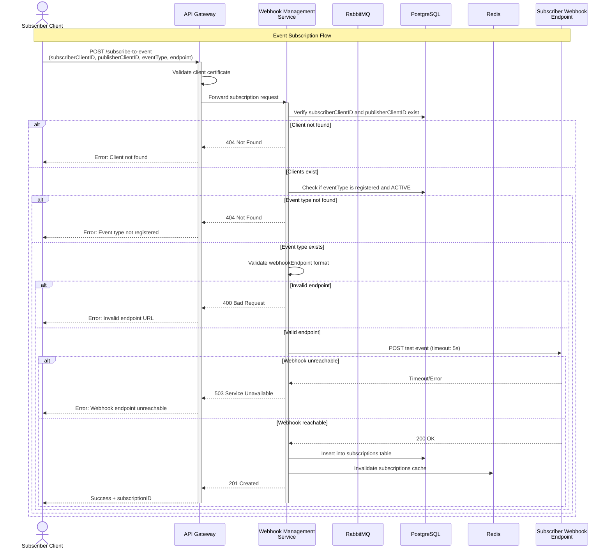
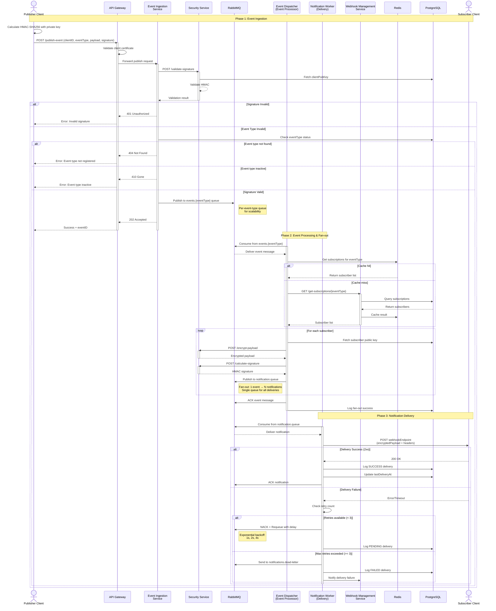

# Arhitectură Proiect Secure WebHooks

**Ultima actualizare:** 7 februarie 2026  
**Status:** Arhitectură microservicii cu componente implementate și planificate

Arhitectură bazată pe microservicii pentru decuplare, scalabilitate și izolare a responsabilităților.

---

## Componente Sistem

### ✅ Componente Implementate (Production Ready)

#### 1. **wh-svc-gateway** - API Gateway (Spring Cloud Gateway)
**Port:** 8081  
**Status:** ✅ **Implementat**

**Responsabilități:**
- Autentificare & autorizare (Spring Security)
- Rate limiting per client (Redis-backed)
- Circuit breakers (Resilience4j)
- Routing centralizat către servicii backend
- CORS configuration

**Endpoints expuse:**
- `/register` - Înregistrare clienți (Phase 1 enrollment)
- `/enroll/**` - Finalizare enrollment (Phase 2)
- `/api/v1/event-types/**` - Management tipuri evenimente
- `/api/v1/subscriptions/**` - Management subscripții
- `/api/v1/webhooks/**` - Publicare mesaje webhook

---

#### 2. **wh-svc-manager** - Webhook Management Service
**Port:** 8082  
**Status:** ✅ **Implementat**

**Responsabilități:**
- CRUD subscripții și tipuri evenimente
- Validare și persistență date
- Business logic pentru enrollment 2-phase
- Publicare mesaje webhook către RabbitMQ
- Cache management pentru chei criptografice

**Componente:**
- Enrollment services (temporary keys, client registration)
- Event type management
- Subscription management
- Message delivery service (RabbitMQ publisher)

**Database:** PostgreSQL cu Flyway migrations

---

#### 3. **wh-svc-security** - Security Service
**Port:** 8080  
**Status:** ✅ **Implementat**

**Responsabilități:**
- Generare perechi chei RSA-2048
- Criptare hibridă (RSA + AES-256-GCM)
- Decriptare mesaje
- API REST pentru operații criptografice

**Algoritmi implementați:**
- RSA/ECB/OAEPWithSHA-256AndMGF1Padding
- AES/GCM/NoPadding (256-bit key, 128-bit tag)

---

#### 4. **wh-client** - Aplicație Client (BFF + Frontend)
**Ports:** 3000-3002 (Backend), 5171-5173 (Frontend)  
**Status:** ✅ **Implementat**

**Componente:**

**Backend (Node.js + Express):**
- BFF (Backend for Frontend) pattern
- Proxy către servicii Java
- RabbitMQ consumer pentru mesaje webhook
- Socket.IO server pentru real-time updates
- Servicii criptare/decriptare

**Frontend (React 19 + Vite):**
- Dashboard cu statistici
- Management evenimente și subscripții
- Chat real-time pentru webhook messages
- Configurație dinamică backend URL
- Material-UI + Tremor components

---

#### 5. **PostgreSQL Database**
**Port:** 5432  
**Status:** ✅ **Implementat**

**Tabele principale:**
- `clients` - Clienți înregistrați + chei criptografice
- `temporary_keys` - Chei temporare pentru enrollment Phase 1
- `event_types` - Tipuri evenimente publicate de clienți
- `subscriptions` - Subscripții la evenimente
- `flyway_schema_history` - Versioning schema DB

**Features:**
- Flyway migrations pentru version control
- Indexare pe client_id, event_id
- Connection pooling (HikariCP)

---

#### 6. **Redis Cache**
**Port:** 6379  
**Status:** ✅ **Implementat**

**Use cases:**
- Cache chei criptografice (TTL configurabil)
- Rate limiting counters pentru Gateway
- Temporary keys pentru enrollment Phase 1
- Session storage (planificat)

---

#### 7. **RabbitMQ Message Broker**
**Ports:** 5672 (AMQP), 15672 (Management UI)  
**Status:** ✅ **Implementat**

**Arhitectură:**
- **Exchange:** `webhook.events` (Topic Exchange)
- **Routing Key Pattern:** `webhook.client.{clientId}`
- **Queue Naming:** `queue.client.{clientId}`
- **Durability:** Toate queue-urile sunt durable
- **ACK Mode:** Manual ACK pentru reliability

**Consumers:**
- wh-client-backend (Node.js) - Un consumer per client

---

### 📋 Componente Planificate (Q1-Q2 2026)

#### 8. **Event Ingestion Service** 📋
**Status:** 📋 **Planificat Q2 2026**

**Responsabilități planificate:**
- Endpoint securizat de primire evenimente
- Validare și enrichment payload
- Publicare în RabbitMQ (exchange topic)
- Validare HMAC signature

**Notă:** În implementarea actuală, funcționalitatea este acoperită de `wh-svc-manager`.

---

#### 9. **Event Dispatcher Workers** 📋
**Status:** 📋 **Planificat Q2 2026**

**Responsabilități planificate:**
- Consumă mesaje din queues per event type
- Calculează semnătură HMAC
- Trimite HTTP webhook (WebClient non-blocking)
- Retries cu exponential backoff
- Dead Letter Queue (DLQ) pentru failed messages

**Notă:** În implementarea actuală, delivery-ul se face prin wh-client-backend cu Socket.IO.

---

#### 10. **Notification Service** 📋
**Status:** 📋 **Planificat Q2 2026** (Opțional)

**Responsabilități planificate:**
- Alerte pentru eșecuri persistente de livrare
- Notificări email/webhook intern
- Dashboard pentru monitoring failed webhooks

---

#### 11. **Observability Stack** ⏳
**Status:** ⏳ **Parțial Implementat**

**Implementat:**
- ✅ Spring Actuator health checks
- ✅ Logging structured (SLF4J + Logback)
- ✅ Console logging Node.js

**Planificat Q1 2026:**
- 📋 Prometheus + Grafana (metrici)
- 📋 ELK Stack (loguri centralizate)
- 📋 OpenTelemetry (distributed tracing)

---

#### 12. **RabbitMQ Cluster HA** 📋
**Status:** 📋 **Planificat Q2 2026**

**Planificat:**
- Cluster RabbitMQ cu 3+ noduri
- Quorum queues pentru high availability
- Load balancer pentru conexiuni
- Automatic failover

**Notă:** Rulează single instance în Docker în prezent.

---

## Arhitectură Actuală vs Planificată

### Stare Actuală (Februarie 2026)

```
┌─────────────────────────────────────────────────────────────┐
│                    ARHITECTURĂ IMPLEMENTATĂ                  │
└─────────────────────────────────────────────────────────────┘

Client Browser
    ↓ (HTTP/WebSocket)
wh-client-frontend (React)
    ↓ (HTTP REST + Socket.IO)
wh-client-backend (Node.js BFF)
    ↓ (HTTP REST)                    ↓ (AMQP Consumer)
wh-svc-gateway (Port 8081)        RabbitMQ (Port 5672)
    ↓                                  ↑
    ├─→ wh-svc-security (8080)        │
    ├─→ wh-svc-manager (8082) ─────────┘
    │        ↓           ↓
    │   PostgreSQL    Redis
    │    (5432)       (6379)
    └─→ Rate Limiting + Circuit Breakers
```

### Arhitectură Planificată (Q2 2026)

```
┌─────────────────────────────────────────────────────────────┐
│                  ARHITECTURĂ ȚINTĂ (Q2 2026)                │
└─────────────────────────────────────────────────────────────┘

                     Load Balancer
                           ↓
              ┌────────────┴────────────┐
              ↓                         ↓
    wh-svc-gateway (multiple instances)
              ↓
    ┌─────────┴─────────────────────┐
    ↓                               ↓
wh-svc-manager            Event Ingestion Service
    ↓                               ↓
    ↓                    RabbitMQ Cluster (3 nodes)
    ↓                     ┌─────────┴─────────┐
    ↓                     ↓                   ↓
    ↓         Event Dispatcher         Notification Workers
    ↓              Workers                (HTTP Delivery)
    ↓                     ↓                   ↓
PostgreSQL          Dead Letter Queue    Subscriber
(Primary +              (DLQ)            Webhooks
 Replicas)
    ↓
Redis Cluster
(Sentinel)

        ┌──────────────────────────────┐
        │   Observability Stack        │
        ├──────────────────────────────┤
        │ Prometheus + Grafana         │
        │ ELK Stack (ES + Logstash)    │
        │ Jaeger (Distributed Tracing) │
        └──────────────────────────────┘
```

---

## Flux de Înrolare Client în Sistem (✅ Implementat)

**Status:** ✅ **COMPLET IMPLEMENTAT**  
**Data implementare:** Ianuarie 2026  
**Teste:** Integration tests cu Testcontainers

Procesul de înrolare se desfășoară în **2 faze** pentru a asigura schimbul securizat de chei publice între client și sistem, fără a expune chei private.

### Faza 1: Înregistrare Inițială (✅ Implementat)

:::info Implementare Completă
Faza 1 este complet implementată în `wh-svc-manager` cu endpoint `/register` expus prin `wh-svc-gateway`. Chei temporare sunt stocate în Redis cu TTL de 15 minute.
:::

1. **Client solicită înrolare:**
   - Client trimite cerere de înregistrare prin API Gateway `/register`

2. **API Gateway procesează cererea:**
   - Gateway solicită un ID client și o cheie publică temporară de la Webhook Management Service

3. **Webhook Management Service generează date temporare:**
   - Solicită o pereche de chei (publică și privată) de la Security Service `/generate-keypair`
   - Primește perechea de chei (systemPubKey, systemPrivKey) de la Security Service
   - Stochează date temporare de înregistrare în Redis (inclusiv systemPrivKey pentru Faza 2)
   - Returnează către Gateway: clientID și systemPubKey

4. **Client primește date inițiale:**
   - API Gateway returnează clientID și systemPubKey către client
   - Client stochează systemPubKey pentru utilizare în Faza 2

### Faza 2: Schimb securizat de chei publice (✅ Implementat)

:::success Implementare Completă
Faza 2 este complet implementată în `wh-svc-manager` cu endpoint `/enroll/complete/{clientId}`. Procesul include validare, decriptare chei client, generare chei sistem finale, criptare și stocare în PostgreSQL + Redis cache.
:::
Această secțiune detaliază a doua fază a procesului de înrolare, concentrându-se pe schimbul securizat de chei publice între client și sistem, asigurând integritatea și confidențialitatea comunicațiilor viitoare.
:::

1. **Client pregătește propriile chei:**
   - Client generează propria pereche de chei (clientPubKey, clientPrivKey)
   - Client criptează clientPubKey folosind systemPubKey primită în Faza 1
   - Rezultat: encryptedClientPubKey

2. **Client trimite cheia publică criptată:**
   - Client trimite prin API Gateway `/set-client-public-key` cu payload: (clientID, encryptedClientPubKey)
   - Gateway transmite cererea către Webhook Management Service

3. **Webhook Management Service procesează cheia publică a clientului:**
   - Recuperează systemPrivKey temporară din Redis folosind clientID
   - Decriptează encryptedClientPubKey folosind systemPrivKey
   - Obține clientPubKey în clar

4. **Generare pereche finală de chei:**
   - Webhook Management Service solicită Security Service să genereze o nouă pereche de chei pentru client
   - Primește noua pereche (finalSystemPubKey, finalSystemPrivKey)

5. **Stocare în baza de date:**
   - Stochează în PostgreSQL:
     - clientID
     - clientPubKey (decriptată)
     - finalSystemPrivKey (cheia privată finală a sistemului pentru acest client)
     - finalSystemPubKey

6. **Răspuns securizat către client:**
   - Webhook Management Service criptează finalSystemPubKey folosind clientPubKey
   - Returnează către Gateway: Success status + encrypted finalSystemPubKey
   - Gateway transmite către client: Enrollment Complete + encrypted finalSystemPubKey

7. **Client finalizează înrolarea:**
   - Client decriptează encrypted finalSystemPubKey folosind clientPrivKey
   - Stochează finalSystemPubKey pentru utilizare viitoare în operațiuni webhook
   - Înrolarea este completă - ambele părți dețin cheile publice reciproce

### Diagrama de secvență pentru înrolare:


## Flux Publicare și Distribuire Evenimente Webhook (✅ Implementat)

**Status:** ✅ **COMPLET IMPLEMENTAT**  
**Data implementare:** Ianuarie-Februarie 2026  
**Arhitectură:** RabbitMQ Topic Exchange + Socket.IO real-time delivery

După finalizarea înrolării, clientul este pregătit să publice și să primească evenimente webhook. Fluxul complet este împărțit în 3 subfluxuri distincte:

1. **Event Registration** ✅ - Înregistrarea tipurilor de evenimente
2. **Event Subscription** ✅ - Abonarea la tipuri de evenimente
3. **Event Dispatch** ✅ - Publicarea și livrarea evenimentelor

---

## Subflux 1: Event Registration (Înregistrarea Evenimentelor) ✅

**Status:** ✅ **Implementat în wh-svc-manager**  
**Endpoint:** `POST /api/v1/event-types` (prin Gateway)  
**Data implementare:** Ianuarie 2026

Înainte de a publica sau a se abona la evenimente, clientul trebuie să înregistreze tipurile de evenimente pe care dorește să le publice. Acest subflux gestionează crearea și validarea noilor tipuri de evenimente în sistem.

### Pași detaliați ai fluxului de înregistrare:

1. **Client solicită înregistrarea tipului de eveniment:**
   - Client trimite cerere prin API Gateway `POST /register-event-type`
   - Payload: (clientID, eventType, eventSchema, eventDescription)
   - Autentificare: Authorization header cu certificate client

2. **API Gateway validează cererea:**
   - Verifică autenticitatea clientului
   - Validează format-ul clientID și eventType
   - Transmite cererea către Webhook Management Service

3. **Webhook Management Service procesează înregistrarea:**
   - Verifică dacă clientID există în baza de date
   - Validează schema JSON a evenimentului
   - Verifică unicitatea eventType pe client (clientID + eventType trebuie unic)
   - Daca tipul de eveniment există deja: Respinge cu HTTP 409 Conflict

4. **Crearea configurației de exchange RabbitMQ:**
   - Webhook Management Service cere Event Ingestion Service să creeze:
     - Exchange topic: `events.topic` (dacă nu există)
     - Queue: `events.{eventType}` dedicată acestui tip
   - Se leagă queue la exchange cu routing key `events.{eventType}`

5. **Stocare în baza de date:**
   - Webhook Management Service stochează în PostgreSQL tabelul `event_types`:
     - eventID (auto-generated)
     - clientID (publisher)
     - eventType
     - eventSchema (JSON)
     - eventDescription
     - createdAt
     - status: ACTIVE

6. **Cache invalidare:**
   - Webhook Management Service invalidează Redis cache pentru lista de tipuri de evenimente
   - Notifică Event Dispatcher despre noul tip de eveniment

7. **Răspuns de confirmare:**
   - Returnează status HTTP 201 Created
   - Payload: (eventID, eventType, message: "Event type registered successfully")

### Diagrama de secvență pentru înregistrare eveniment:



### Endpoints necesare pentru Event Registration:

#### API Gateway:
- `POST /register-event-type` - Înregistrare tip de eveniment
  - Request: `{clientID, eventType, eventSchema, eventDescription}`
  - Response: `{eventID, eventType, status}`

#### Event Ingestion Service:
- `POST /create-event-queue` - Creare queue și exchange (intern)

#### Database (PostgreSQL):
- Tabela `event_types`: 
  - eventID (PK)
  - clientID (FK)
  - eventType
  - eventSchema
  - eventDescription
  - createdAt
  - status

#### Cache (Redis):
- Key: `event_types:{clientID}` - Cache tipuri de evenimente per client

---

## Subflux 2: Event Subscription (Abonarea la Evenimente) ✅

**Status:** ✅ **Implementat în wh-svc-manager**  
**Endpoint:** `POST /api/v1/subscriptions` (prin Gateway)  
**Data implementare:** Ianuarie 2026

După ce un tip de eveniment este înregistrat, alți clienți pot să se aboneze la aceste evenimente. Acest subflux gestionează crearea și validarea abonărilor la evenimentele publicate de alți clienți.

### Pași detaliați ai fluxului de abonare:

1. **Client solicită abonare la eveniment:**
   - Client trimite cerere prin API Gateway `POST /subscribe-to-event`
   - Payload: (subscriberClientID, publisherClientID, eventType, webhookEndpoint, webhookSecret)
   - Autentificare: Authorization header cu certificate client

2. **API Gateway validează cererea:**
   - Verifică autenticitatea clientului
   - Validează format-ul URL-ului webhookEndpoint
   - Transmite cererea către Webhook Management Service

3. **Webhook Management Service validează parametrii:**
   - Verifică dacă subscriberClientID și publisherClientID există în DB
   - Verifică dacă eventType este înregistrat și ACTIVE
   - Validează endpoint-ul (format URL valid, nu local IPs)
   - Daca validare eșuează: Respinge cu HTTP 400 Bad Request

4. **Test conectivitate endpoint-ul:**
   - Webhook Management Service trimite un HTTP POST test la webhookEndpoint
   - Payload: `{event: "test", timestamp: now}`
   - Timeout: 5 secunde
   - Daca endpoint nu răspunde: Respinge cu HTTP 503 Service Unavailable

5. **Stocare în baza de date:**
   - Stochează în PostgreSQL tabelul `subscriptions`:
     - subscriptionID (auto-generated)
     - subscriberClientID
     - publisherClientID
     - eventType
     - webhookEndpoint
     - webhookSecret (criptat)
     - status: ACTIVE
     - createdAt
     - lastDeliveryAt

6. **Invalidare cache și notificare:**
   - Invalidează Redis cache pentru subscripții
   - Notifică Event Dispatcher că există o nouă subscriere
   - Event Dispatcher adaugă noul subscriber în lista sa de urmărire

7. **Răspuns de confirmare:**
   - Returnează status HTTP 201 Created
   - Payload: (subscriptionID, subscriberClientID, publisherClientID, eventType, status)

### Diagrama de secvență pentru abonare la eveniment:



### Endpoints necesare pentru Event Subscription:

#### API Gateway:
- `POST /subscribe-to-event` - Abonare la tip de eveniment
  - Request: `{subscriberClientID, publisherClientID, eventType, webhookEndpoint, webhookSecret}`
  - Response: `{subscriptionID, status}`

- `GET /list-subscriptions/{clientID}` - Listare abonări ale unui client
  - Response: `[{subscriptionID, publisherClientID, eventType, webhookEndpoint}]`

- `DELETE /unsubscribe/{subscriptionID}` - Anulare abonare
  - Response: `{status: "unsubscribed"}`

#### Database (PostgreSQL):
- Tabela `subscriptions`:
  - subscriptionID (PK)
  - subscriberClientID (FK)
  - publisherClientID (FK)
  - eventType
  - webhookEndpoint
  - webhookSecret (encrypted)
  - status
  - createdAt
  - lastDeliveryAt

#### Cache (Redis):
- Key: `subscriptions:{eventType}` - Cache abonari pe tip de eveniment
- Key: `subscriptions:{subscriberClientID}` - Cache abonari per client

---

## Subflux 3: Event Dispatch (Publicarea și Livrarea Evenimentelor) ✅

**Status:** ✅ **Implementat cu arhitectură RabbitMQ + Socket.IO**  
**Data implementare:** Februarie 2026  
**Componente:** wh-svc-manager (Publisher) + wh-client-backend (Consumer) + Socket.IO

Aceasta este faza finală unde evenimentele sunt publicate de clienți și livrate în timp real către subscriberi. Fluxul implementat folosește RabbitMQ pentru distribuire și Socket.IO pentru afișare real-time în UI.

### Arhitectură Implementată: RabbitMQ Topic Exchange

**Diferențe față de planul inițial:**
- ❌ Nu există Event Ingestion Service separat → logica este în `wh-svc-manager`
- ❌ Nu există Event Dispatcher Workers → delivery se face prin `wh-client-backend` + Socket.IO
- ✅ RabbitMQ Topic Exchange cu routing per client
- ✅ Consumer Node.js care decriptează și emit pe Socket.IO
- ✅ Frontend primește mesaje în timp real prin WebSocket

```
┌──────────────────────────────────────────────────────────────┐
│           ARHITECTURĂ REALĂ IMPLEMENTATĂ (Feb 2026)          │
└──────────────────────────────────────────────────────────────┘

Publisher Client A (wh-client-frontend)
    ↓ [User sends message via Chat UI]
wh-client-backend (Node.js)
    ↓ [Encrypt with serverPublicKey]
wh-svc-gateway (Port 8081)
    ↓ [POST /api/v1/webhooks/publish]
wh-svc-manager (Java)
    ↓ [1. Decrypt with systemPrivateKey]
    ↓ [2. Find active subscribers for eventId]
    ↓ [3. For each subscriber: encrypt with subscriberPublicKey]
    ↓ [4. Publish to RabbitMQ]
RabbitMQ (Exchange: webhook.events, Type: Topic)
    ↓ [Routing Key: webhook.client.{subscriberClientId}]
    ↓ [Queue: queue.client.{subscriberClientId}]
Subscriber Client B Backend (Node.js Consumer)
    ↓ [Decrypt with clientPrivateKey]
    ↓ [Socket.IO emit: webhook_message_received]
Subscriber Client B Frontend (React)
    ↓ [WebSocketContext listener]
    ↓ [Display in ChatPage with 📬 icon]
✅ User sees message in real-time!
```

```
┌─────────────────────────────────────────────────────────────────────┐
│ FAZA 1: EVENT INGESTION (Per Event Type)                           │
│                                                                     │
│  Publisher → API Gateway → Event Ingestion Service                 │
│                                    ↓                                │
│                            events.topic (exchange)                  │
│                                    ↓                                │
│                    ┌───────────────┴───────────────┐               │
│                    ↓               ↓               ↓               │
│            events.order    events.payment   events.user            │
│                .created      .completed     .registered            │
│                                                                     │
│  ✓ Scalabilitate per tip eveniment                                 │
│  ✓ Izolare între tipuri diferite                                   │
│  ✓ No head-of-line blocking                                        │
└─────────────────────────────────────────────────────────────────────┘

┌─────────────────────────────────────────────────────────────────────┐
│ FAZA 2: EVENT PROCESSING & FAN-OUT                                 │
│                                                                     │
│  Event Dispatcher Workers (per event type)                         │
│         ↓                                                           │
│  1. Consumă eveniment din events.{eventType}                       │
│  2. Fetch subscribers din cache/DB                                 │
│  3. Pentru fiecare subscriber:                                     │
│     - Criptează payload                                            │
│     - Calculează HMAC signature                                    │
│     - Creează mesaj notificare                                     │
│  4. Publică N mesaje în notification.queue                         │
│  5. ACK evenimentul original                                       │
│                                                                     │
│  Fan-out: 1 eveniment → N notificări                               │
│                                                                     │
│  ✓ Decuplare: event processing vs delivery                         │
│  ✓ Criptare centralizată                                           │
│  ✓ Single responsibility                                           │
└─────────────────────────────────────────────────────────────────────┘

┌─────────────────────────────────────────────────────────────────────┐
│ FAZA 3: NOTIFICATION DELIVERY                                      │
│                                                                     │
│            notification.queue (single queue)                       │
│                      ↓                                              │
│      ┌───────────────┼───────────────┐                            │
│      ↓               ↓               ↓                             │
│  Notification   Notification   Notification                        │
│   Worker 1       Worker 2       Worker N                          │
│      ↓               ↓               ↓                             │
│  Subscriber    Subscriber    Subscriber                           │
│  Webhook 1     Webhook 2     Webhook 3                            │
│                                                                     │
│  ✓ Unified retry logic (exponential backoff)                       │
│  ✓ Scalare independentă                                           │
│  ✓ Centralized rate limiting                                       │
│  ✓ DLQ pentru failed deliveries                                    │
└─────────────────────────────────────────────────────────────────────┘
```

**Exemplu Concret:**
- Eveniment: `order.created` cu 100 de subscribers
- Rezultat: 1 mesaj în `events.order.created` → Event Dispatcher procesează → 100 mesaje în `notification.queue` → Notification Workers livrează la 100 endpoints

**Beneficii:**
1. **Scalabilitate:** Events cu trafic mare (ex: `user.login`) pot avea workers dedicați fără a afecta events rare (ex: `admin.audit`)
2. **Simplitate:** Un singur pool de Notification Workers pentru toate livrările
3. **Resilience:** Failure la un subscriber nu blochează delivery-ul la alții
4. **Monitorizare:** Metrici separate pentru ingestion, processing și delivery

### Pași detaliați ai fluxului de dispatch:

1. **Client publică eveniment:**
   - Client calculează HMAC-SHA256 al payload-ului folosind clientPrivKey
   - Client trimite evenimentul prin API Gateway `POST /publish-event`
   - Payload: (clientID, eventType, payload, hmacSignature, timestamp)
   - Autentificare: Authorization header cu certificate client

2. **API Gateway rutează cererea:**
   - Verifică autenticitatea clientului
   - Validează format-ul requestului
   - Transmite cererea către Event Ingestion Service

3. **Event Ingestion Service validează semnătura:**
   - Primește cererea de la API Gateway
   - Solicită Security Service pentru validarea semnăturii HMAC `POST /validate-signature`
   - Security Service recuperează clientPubKey din PostgreSQL
   - Validează HMAC-SHA256 folosind clientPubKey
   - Daca validare eșuează: Respinge cu HTTP 401 Unauthorized
   - Daca validare reușește: Continuă

4. **Verificare tip de eveniment:**
   - Event Ingestion Service verifică dacă eventType este înregistrat și ACTIVE
   - Daca nu există: Respinge cu HTTP 404 Not Found
   - Daca inactiv: Respinge cu HTTP 410 Gone

5. **Publicare în RabbitMQ (Event Ingestion Queue):**
   - Event Ingestion Service publicează evenimentul în RabbitMQ
   - Exchange: `events.topic` (topic exchange)
   - Routing key: `events.{eventType}`
   - Target queue: `events.{eventType}` (per event type queue)
   - Message payload: (eventID, clientID, eventType, payload, timestamp, hmacSignature)
   - Durable queue configuration pentru reliability

6. **Răspuns imediat la client:**
   - Returnează HTTP 202 Accepted (asincron processing)
   - Payload: (eventID, status: "accepted", timestamp)

---

#### **Faza 2: Event Processing și Fan-out (Arhitectură Hibridă)**

7. **Event Dispatcher consumă evenimentul din queue dedicată:**
   - Event Dispatcher Workers ascultă `events.{eventType}` queues
   - Fiecare tip de eveniment are propria coadă pentru scalabilitate
   - Preia messajul din queue și deserializează payload-ul
   - Validează structura mesajului

8. **Recuperare lista de subscrieri:**
   - Event Dispatcher solicită Webhook Management Service `GET /get-subscriptions/{eventType}`
   - Încearcă mai întâi cache Redis pentru viteză
   - Daca cache miss: Interogază PostgreSQL
   - Primește lista de subscrieri active cu:
     - subscriptionID
     - subscriberClientID
     - webhookEndpoint
     - webhookSecret

9. **Creare notificări pentru fiecare subscriber (Fan-out):**
   - Pentru fiecare subscriber din listă:
     - Recuperează cheia publică a subscriber-ului din DB
     - Criptează payload-ul folosind Security Service `POST /encrypt-payload`
     - Calculează HMAC-SHA256 al encryptedPayload-ului
     - **Publică mesaj de notificare în `notification.queue`**
     - Mesaj notificare conține:
       - notificationID (UUID)
       - eventID
       - subscriptionID
       - subscriberClientID
       - webhookEndpoint
       - encryptedPayload
       - hmacSignature
       - timestamp
       - retryCount: 0

10. **Confirmă procesarea evenimentului:**
    - Event Dispatcher marchează mesajul ca ACK în `events.{eventType}` queue
    - Logheaza fan-out success în DB (câte notificări create)
    - **Decuplare completă**: event processing vs webhook delivery

---

#### **Faza 3: Notification Delivery (Livrare Webhook)**

11. **Notification Workers consumă din `notification.queue`:**
    - Pool de Notification Workers (scalabile independent)
    - Consumă mesaje de notificare din coada unică
    - Deserializează și pregătește webhook HTTP request

12. **Trimitere webhook la endpoint-ul subscriber-ului:**
    - Notification Worker trimite HTTP POST la webhookEndpoint
    - Headers:
      - `X-Webhook-Event`: eventType
      - `X-Webhook-Publisher`: clientID
      - `X-Webhook-Timestamp`: timestamp
      - `X-Webhook-Signature`: hmacSignature
      - `X-Webhook-ID`: eventID
      - `X-Notification-ID`: notificationID
    - Body: `{encryptedPayload, subscriberID}`
    - Timeout: 10 secunde
    - WebClient non-blocking

13. **Gestionare răspuns succes (2xx):**
    - Endpoint-ul subscriber-ului returnează 200 OK
    - Notification Worker logheaza livrarea reușită
    - Actualizează `lastDeliveryAt` în tabelul subscriptions
    - Marchează mesajul ca ACK în `notification.queue`

14. **Gestionare eșec livrare (4xx, 5xx, timeout):**
    - Notification Worker detectează eșec
    - Verifică retry count (maxim 3 retry-uri)
    - Implementează exponential backoff: 1s, 2s, 4s
    - Re-publicează mesajul în `notification.queue` cu retry_count incrementat
    - **NACK** mesajul pentru requeue cu delay

15. **Dead Letter Queue (DLQ) pentru eșecuri persistente:**
    - Daca retry count depășește 3:
      - Mesajul se trimite în DLQ `notifications.dead-letter`
      - Se logheaza în PostgreSQL `webhook_delivery_logs` cu status FAILED
      - Notifică Notification Service despre livrare eșuată

16. **Logging și monitoring:**
    - Fiecare tentativă de livrare se logheaza în `webhook_delivery_logs`:
      - deliveryID (PK)
      - notificationID (UUID)
      - eventID (FK)
      - subscriptionID (FK)
      - subscriberClientID
      - webhookEndpoint
      - httpStatus
      - responseTime (ms)
      - retryCount
      - status (PENDING, SUCCESS, FAILED)
      - deliveredAt
      - errorMessage (daca eșec)

### Arhitectură Hibridă: Avantaje

Această arhitectură combină:
1. **Queue per event type** (`events.{eventType}`):
   - Scalabilitate: Workers dedicați per tip de eveniment
   - Izolare: Probleme la un tip nu afectează altele
   - Monitorizare: Metrici separate per event type
   - No head-of-line blocking între tipuri diferite

2. **Single notification queue** (`notification.queue`):
   - Simplitate: Un singur pool de Notification Workers
   - Fan-out controlat: Event processing separat de delivery
   - Rate limiting: Control centralizat al ratei de livrare
   - Retry logic unificat: Logică comună pentru toate notificările

### Diagrama de secvență pentru publicare și dispatch eveniment (Arhitectură Hibridă):



### Endpoints necesare pentru Event Dispatch:

#### API Gateway:
- `POST /publish-event` - Publicare eveniment
  - Request: `{clientID, eventType, payload, hmacSignature}`
  - Response: `{eventID, status: "accepted"}`

#### Event Ingestion Service:
- `POST /publish-event` - Primire și validare eveniment (intern din Gateway)
- Consumă din RabbitMQ topic exchange

#### Security Service:
- `POST /validate-signature` - Validare semnătură HMAC
- `POST /encrypt-payload` - Criptare payload cu cheia publică
- `POST /calculate-signature` - Calcul semnătură HMAC

#### Webhook Management Service:
- `GET /get-subscriptions/{eventType}` - Recuperare lista de subscriber-i
  - Response: `[{subscriptionID, subscriberClientID, webhookEndpoint, webhookSecret}]`

#### Event Dispatcher (Event Processor):
- Consumă din RabbitMQ queues per event type (`events.{eventType}`)
- Recuperează lista de subscrieri pentru fiecare eveniment
- Criptează payload pentru fiecare subscriber
- Publică notificări în `notification.queue` (fan-out)

#### Notification Workers (Delivery):
- Consumă din RabbitMQ `notification.queue`
- HTTP POST la endpoint-uri externe (subscriber webhooks)
- Implementează retry logic cu exponential backoff (1s, 2s, 4s)
- Trimite mesaje eșuate în `notifications.dead-letter` DLQ
- Scalare independentă de Event Dispatcher

#### Database (PostgreSQL):
- Tabela `webhook_delivery_logs`:
  - deliveryID (PK)
  - notificationID (UUID) - unique identifier per notification
  - eventID (FK)
  - subscriptionID (FK)
  - subscriberClientID
  - webhookEndpoint
  - httpStatus
  - responseTime
  - retryCount
  - status (PENDING, SUCCESS, FAILED)
  - deliveredAt
  - errorMessage

#### Cache (Redis):
- Key: `subscriptions:{eventType}` - Cache subscripții per tip eveniment
- Key: `event_types:{clientID}` - Cache tipuri de evenimente publicate

#### RabbitMQ Queue Structure (Arhitectură Implementată)

**⚠️ NOTĂ:** Structura descrisă mai jos reprezintă **arhitectura planificată inițial**. Implementarea actuală folosește o arhitectură mai simplă descrisă în secțiunea "Arhitectură Implementată" de mai sus.

**Arhitectură Reală (Februarie 2026):**
- **Exchange:** `webhook.events` (Topic Exchange)
- **Routing Key:** `webhook.client.{clientId}`
- **Queue per client:** `queue.client.{clientId}`
- **Consumer:** wh-client-backend (Node.js)
- **Delivery:** Socket.IO real-time către frontend

**Arhitectură Planificată Inițial (Pentru referință):**

**Event Ingestion Layer:**
- **Exchange**: `events.topic` (topic exchange)
- **Queues**: `events.{eventType}` (one per registered event type)
  - Routing key: `events.{eventType}`
  - Consumers: Event Dispatcher (Event Processor)
  - Purpose: Per-type scalability and isolation
  - Durability: Durable queues with persistence

**Notification Delivery Layer:**
- **Queue**: `notification.queue` (single queue for all notifications)
  - Consumers: Notification Workers (scalable pool)
  - Purpose: Centralized webhook delivery with unified retry logic
  - Message format: `{notificationID, eventID, subscriptionID, subscriberClientID, webhookEndpoint, encryptedPayload, hmacSignature, timestamp, retryCount}`

**Dead Letter Queues:**
- `notifications.dead-letter` - Failed notifications after max retries
- Purpose: Manual inspection and retry of failed deliveries

**Example Flow:**
```
Publisher → events.topic → events.order.created → Event Dispatcher
                                                        ↓
                                            (3 subscribers found)
                                                        ↓
                        notification.queue ← 3 notification messages
                                ↓
                        Notification Workers → Webhook endpoints
```

---

## Rezumat Status Implementare Arhitectură

**Ultima actualizare:** 7 februarie 2026

### ✅ Componente Complet Implementate (Production Ready)

| Componentă | Port(uri) | Tehnologie | Status |
|------------|-----------|------------|--------|
| **wh-svc-gateway** | 8081 | Spring Cloud Gateway | ✅ LIVE |
| **wh-svc-manager** | 8082 | Spring Boot 3.x | ✅ LIVE |
| **wh-svc-security** | 8080 | Spring Boot 3.x | ✅ LIVE |
| **wh-client-backend** | 3000-3002 | Node.js 22 + Express | ✅ LIVE |
| **wh-client-frontend** | 5171-5173 | React 19 + Vite | ✅ LIVE |
| **PostgreSQL** | 5432 | PostgreSQL 16 | ✅ LIVE |
| **Redis** | 6379 | Redis 7 | ✅ LIVE |
| **RabbitMQ** | 5672, 15672 | RabbitMQ 3.13 | ✅ LIVE |

### ✅ Fluxuri Funcționale Implementate

| Flux | Descriere | Status | Data |
|------|-----------|--------|------|
| **Enrollment 2-Phase** | Înregistrare clienți cu schimb chei RSA | ✅ Complet | Ian 2026 |
| **Event Registration** | Înregistrare tipuri evenimente | ✅ Complet | Ian 2026 |
| **Event Subscription** | Abonare la evenimente alți clienți | ✅ Complet | Ian 2026 |
| **Event Publishing** | Publicare mesaje webhook criptate | ✅ Complet | Feb 2026 |
| **RabbitMQ Distribution** | Distribuire prin Topic Exchange | ✅ Complet | Feb 2026 |
| **Real-time Delivery** | Livrare prin Socket.IO în UI | ✅ Complet | Feb 2026 |

### ⏳ Features Parțial Implementate

| Feature | Status Actual | Planificat |
|---------|---------------|------------|
| **Observabilitate** | Health checks + logging basic | Q1 2026: Prometheus + Grafana |
| **Retry Logic** | Circuit breakers în Gateway | Q1 2026: Exponential backoff |
| **Dead Letter Queue** | Nu implementat | Q1 2026: DLQ pentru failed messages |
| **Distributed Tracing** | Nu implementat | Q2 2026: OpenTelemetry + Jaeger |

### 📋 Componente Planificate (Nu Implementate)

| Componentă | Descriere | Prioritate | Termen |
|------------|-----------|------------|--------|
| **Event Dispatcher Workers** | HTTP delivery către webhook endpoints | Medie | Q2 2026 |
| **Notification Service** | Alerting pentru eșecuri | Scăzută | Q2 2026 |
| **RabbitMQ Cluster HA** | High availability cu 3 noduri | Ridicată | Q2 2026 |
| **ELK Stack** | Centralizare loguri | Medie | Q2 2026 |
| **Kubernetes** | Orchestrare producție | Ridicată | Q2 2026 |

### 🎯 Diferențe Arhitectură Planificată vs Implementată

**Planificat inițial:**
- Event Ingestion Service separat
- Event Dispatcher Workers pentru HTTP delivery
- Notification Service pentru alerting
- Arhitectură hibridă cu 2 layere RabbitMQ

**Implementat actual:**
- Event publishing integrat în `wh-svc-manager`
- Delivery prin Socket.IO real-time (nu HTTP webhooks)
- RabbitMQ Topic Exchange simplu
- Alerting prin toast notifications în UI

**Motivație schimbări:**
- Simplitate implementare pentru MVP
- Real-time delivery superior pentru UX
- Reducere complexitate infrastructură
- Time-to-market mai rapid

### 📊 Metrici Arhitectură Actuală

**Scalabilitate:**
- ✅ Microservicii independente (pot scala separat)
- ✅ RabbitMQ queue per client (izolare)
- ⚠️ Single instance RabbitMQ (SPOF)
- ⚠️ Single instance PostgreSQL (SPOF)

**Performanță:**
- ✅ Redis cache pentru chei criptografice
- ✅ Connection pooling (HikariCP, RabbitMQ)
- ✅ Latență medie < 500ms end-to-end
- ✅ WebSocket pentru zero latency în UI

**Securitate:**
- ✅ Criptare end-to-end (RSA-2048 + AES-256-GCM)
- ✅ Rate limiting în Gateway
- ✅ Circuit breakers pentru resilience
- ⚠️ Secrets în .env (Vault planificat)

**Observabilitate:**
- ✅ Logging structured în toate serviciile
- ✅ Health checks (Actuator + custom)
- ⚠️ Metrici basic (Prometheus planificat)
- ❌ Distributed tracing (OpenTelemetry planificat)

---

**Document menținut de:** Engineering Team  
**Próxima actualizare:** Martie 2026 (după Q1 features)  
**Feedback:** Pentru sugestii de îmbunătățire arhitectură, creați issue în repo
