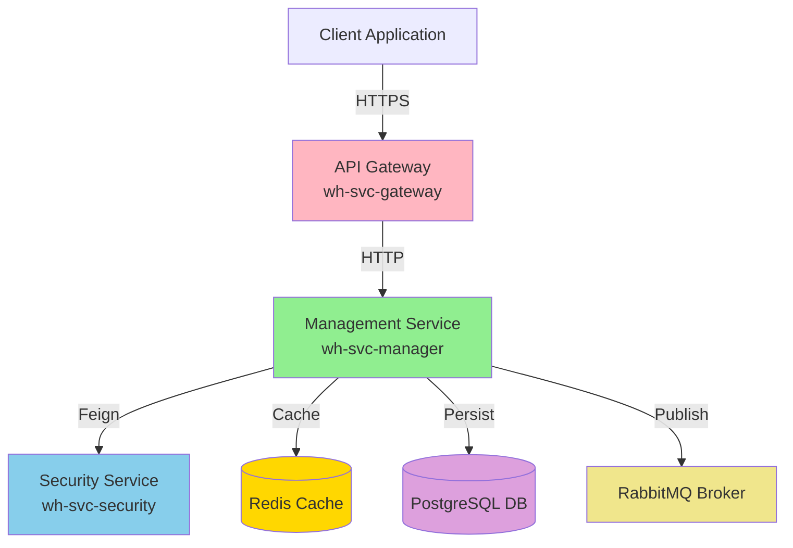
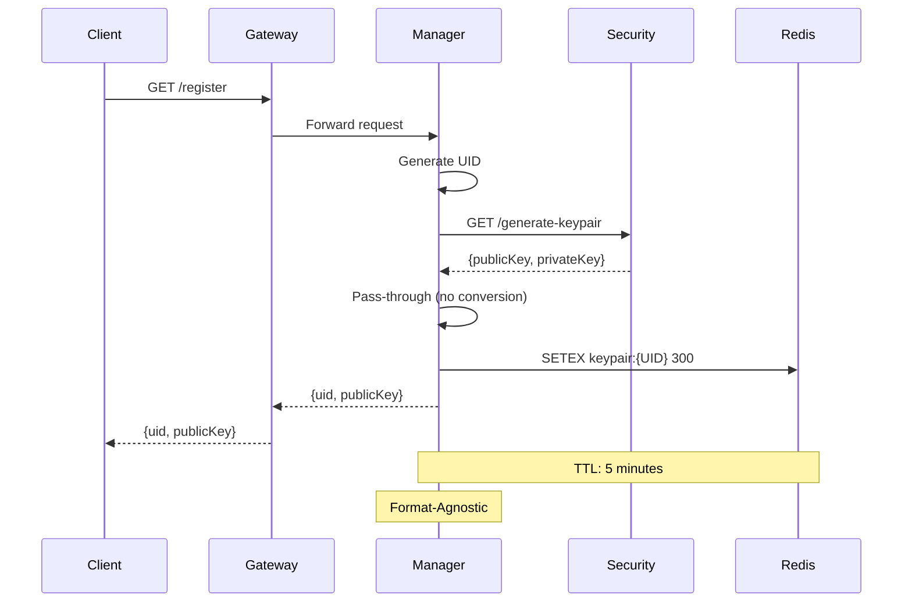

# Bine ai venit la Secure WebHooks Documentation

Documentația completă pentru proiectul **Secure WebHooks** - o platformă distribuită de management și procesare webhook-uri cu securitate avansată.

## 🎯 Despre Proiect

**Secure WebHooks** este un sistem de management webhook-uri care oferă:

- 🔐 **Securitate Avansată**: Criptare end-to-end cu RSA keypairs
- 🚀 **Performanță**: Redis cache, async processing cu RabbitMQ
- 📡 **Scalabilitate**: Arhitectură microservicii, deployment containerizat
- 🔄 **Reliabilitate**: Circuit breaker, retry logic, health monitoring
- 🎨 **Format-Agnostic**: Suport flexibil pentru multiple formate de chei (Base64, PEM, DER, JWK)

## 🏗️ Arhitectură Sistem

### Componente Principale



### Flow Client Registration



## 📚 Navigare Documentație

### 🚀 Quick Start

Pentru a începe rapid cu proiectul:

1. **[Plan de Proiect](./PlanDeProiect/obiective.md)** - Obiective, tehnologii, riscuri
2. **[Arhitectura](./PlanDeProiect/arhitectura.md)** - Design și pattern-uri arhitecturale
3. **[Implementare](./PlanDeProiect/implementare.md)** - Ghid de implementare

### 🔧 Documentație Tehnică

Pentru detalii tehnice despre componente:

1. **[Overview Tehnic](./DocumentatieTehnica/)** - Introducere și structură
2. **[Webhook Management Service](./DocumentatieTehnica/Componente sistem/webhook-management-service.md)** ⭐ - Serviciul central
3. **[Security Service](./DocumentatieTehnica/Componente sistem/SecurityService/)** - Criptare și keypair
4. **[Gateway Service](./DocumentatieTehnica/Componente sistem/api-gateway.md)** - API Gateway
5. **[Redis](./DocumentatieTehnica/Componente sistem/redis.md)** - Cache distribuit
6. **[PostgreSQL](./DocumentatieTehnica/Componente sistem/postgresql.md)** - Database
7. **[RabbitMQ](./DocumentatieTehnica/Componente sistem/rabbitmq.md)** - Message broker

### 📖 Tutoriale

Pentru învățare pas-cu-pas:

- **[Tutorial Basics](./Tutoriale/tutorial-basics/)** - Concepte fundamentale
- **[Tutorial Extras](./Tutoriale/tutorial-extras/)** - Funcționalități avansate

## 🌟 Actualizări Recente

### Octombrie 2025 - Format-Agnostic Refactoring

**Major Update** în Webhook Management Service:

#### Ce s-a schimbat?

✅ **Eliminat** procesarea formatului cheilor criptografice  
✅ **Implementat** pass-through transparent pentru toate formatele  
✅ **Decuplat** serviciile - zero dependențe de format  
✅ **Simplificat** codul - reducere 16.7% linii de cod  

#### De ce?

**Înainte**:
```
Security (Base64) → Manager (convertește la PEM) → Manager (elimină PEM) → Client (Base64)
```

**Acum**:
```
Security (orice format) → Manager (transparent) → Client (același format)
```

#### Beneficii

| Aspect | Îmbunătățire |
|--------|--------------|
| **Flexibilitate** | 🟢 Suport orice format (Base64/PEM/DER/JWK) |
| **Mentenabilitate** | 🟢 Cod simplu, fără conversii |
| **Performance** | 🟢 Zero overhead procesare |
| **Cuplare** | 🟢 Servicii complet decuplate |

📄 **Detalii complete**: Vezi [Webhook Management Service - Format-Agnostic Refactoring](./DocumentatieTehnica/Componente%20sistem/webhook-management-service.md#refactoring-major-format-agnostic-key-handling)

## 🚀 Getting Started

### Prerequisite

Înainte de a începe, asigură-te că ai instalat:

- **Java 21** (LTS) - pentru serviciile backend
- **Node.js 20+** - pentru documentație și tooling
- **Docker & Docker Compose** - pentru containerizare
- **Maven 3.9+** - pentru build Java projects
- **PostgreSQL 16** - database
- **Redis 7.4+** - cache
- **RabbitMQ 3.13** - message broker

### Quick Start Local

```bash
# 1. Clone repository
git clone https://github.com/your-org/WebHooksProject.git
cd WebHooksProject

# 2. Start infrastructure (Redis, PostgreSQL, RabbitMQ)
cd wh-docker-system
docker-compose up -d

# 3. Start services
# Terminal 1: Security Service
cd ../wh-svc-security
mvn spring-boot:run

# Terminal 2: Manager Service
cd ../wh-svc-manager
mvn spring-boot:run

# Terminal 3: Gateway Service
cd ../wh-svc-gateway
mvn spring-boot:run

# 4. Test registration
curl http://localhost:8082/register
```

### Verificare Deployment

```bash
# Health checks
curl http://localhost:8080/actuator/health  # Security
curl http://localhost:8082/actuator/health  # Manager
curl http://localhost:8081/actuator/health  # Gateway

# API Documentation
open http://localhost:8082/swagger-ui/index.html  # Manager API
open http://localhost:8080/swagger-ui/index.html  # Security API

# Redis verification
docker exec wh-redis redis-cli KEYS "keypair:*"

# Database verification
docker exec -it wh-postgres psql -U webhook_user -d webhooks_db
```

## 📖 API Reference

### Manager Service (port 8082)

#### GET /register
Client registration cu generare UID și keypair.

**Response**:
```json
{
  "uid": "35dc782c-6fbc-436a-afd4-604a7df422bb",
  "publicKey": "MIIBIjANBgkqhkiG9w0BAQEFAAOCAQ8AMIIBCgKCAQEA..."
}
```

### Security Service (port 8080)

#### GET /generate-keypair
Generare RSA keypair 2048-bit.

**Response**:
```json
{
  "publicKey": "MIIBIjANBgkqhkiG9w0BAQEFAAOCAQ8AMIIBCgKCAQEA...",
  "privateKey": "MIIEvgIBADANBgkqhkiG9w0BAQEFAASCBKgwggSkAgEAAoIBAQ..."
}
```

## 🔧 Technology Stack

### Backend Services

- **Java 21** (LTS)
- **Spring Boot 3.5.0**
- **Spring Cloud OpenFeign 4.2.0**
- **Spring Data JPA & Redis**
- **PostgreSQL 42.7.7** driver
- **Resilience4j 2.2.0**

### Infrastructure

- **Redis 7.4.6** - Cache distribuit
- **PostgreSQL 16** - Database relațională
- **RabbitMQ 3.13** - Message broker
- **Docker** - Containerizare
- **Docker Compose** - Orchestrare local

### Monitoring & Docs

- **Spring Boot Actuator** - Health checks & metrics
- **SpringDoc OpenAPI 2.6.0** - API documentation
- **Micrometer** - Metrics collection
- **Docusaurus** - Documentation site

## 📚 Resurse Adiționale

### Documentație Externă

- [Spring Boot Documentation](https://spring.io/projects/spring-boot)
- [Spring Cloud OpenFeign](https://spring.io/projects/spring-cloud-openfeign)
- [Redis Documentation](https://redis.io/docs/)
- [PostgreSQL Documentation](https://www.postgresql.org/docs/)
- [RabbitMQ Documentation](https://www.rabbitmq.com/documentation.html)

### Best Practices

- [Hexagonal Architecture](https://alistair.cockburn.us/hexagonal-architecture/)
- [Microservices Patterns](https://microservices.io/patterns/)
- [12 Factor App](https://12factor.net/)
- [RESTful API Design](https://restfulapi.net/)

## 🤝 Contributing

Pentru a contribui la proiect:

1. Fork repository-ul
2. Creează un feature branch (`git checkout -b feature/AmazingFeature`)
3. Commit changes (`git commit -m 'Add some AmazingFeature'`)
4. Push la branch (`git push origin feature/AmazingFeature`)
5. Deschide un Pull Request

## 📞 Contact

- **Development Team**: dev-team@example.com
- **Technical Lead**: tech-lead@example.com
- **DevOps**: devops@example.com

## 📄 License

Acest proiect este proprietate privată. Toate drepturile rezervate.

---

**Ultima actualizare**: 26 Octombrie 2025  
**Versiune documentație**: 2.0  
**Status**: ✅ Production Ready
